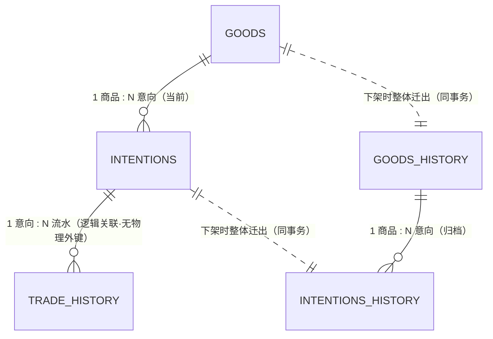

# simple-shop 在线购物系统 数据库与数据层设计说明书

> **文档定位**：本项目**后端数据层**的详细设计文档，覆盖**数据库结构（DDL）、JPA 实体（entity）、仓储接口（repository）** 三部分，作为编码、建表与数据层验收的直接依据。
> **编写阶段**：阶段二 · 开发阶段（数据层）
> **上游依据**：《需求规格说明书》第 3 章（设计约束 `C-01` ~ `C-18`）、第 4 章（状态机 `PS-01` ~ `PS-08`、`IS-01` ~ `IS-10`、`BR-01` ~ `BR-10`）、第 7 章（口令码专题 `S7-01` ~ `S7-04`）、第 8 章（业务规则 `BR-11` ~ `BR-33`、不变量 `INV-01` ~ `INV-08`）、**第 9 章（数据字典，本文档字段口径的唯一来源）**、第 11 章（接口需求，仅用于核对字段消费方式）、第 12 章（非功能需求 `NFR-01`、`NFR-07`、`NFR-08`、`NFR-11`、`NFR-18`）
> **状态**：**13 项待决事项已全部拍板（第 11 章）**，正文已同步为定稿值。评审意见「枚举与用户输入字符串类约束不下沉数据库」已采纳并落为 `DEC-DB-14`（§10.3）——据此**删除 17 条 `CHECK` 与 2 条唯一索引**。
> **✅ 上游已完成同步修订**：《需求规格说明书》已升至 **v1.1**（实质性修订第 7、8、9、10、11、12、13 章，各处均添加「修订记录」；第 1 章同步版本、第 3 章补登备份范围；**第 2、4、5、6 章经逐章核对确认无需修订**）。核对清单与完成情况见 [§11.2](#112-需求规格说明书的同步修订-已完成)／[§11.4](#114-待同步到其他文档的事项--已全部完成)。
> **本文档与上游 v1.1 口径已对齐，可开展数据层实现。**本版（文档 v1.2）仅更新「上游同步状态」，**技术内容未变**。

---

## 文档信息

| 项目 | 内容 |
| --- | --- |
| 系统名称 | simple-shop 在线购物系统 |
| 文档名称 | 数据库与数据层设计说明书 |
| 版本 | **v1.2**（上游已同步修订为 v1.1；技术内容与 v1.1 一致。v1.2 另含 2026-10-09 的实现期订正 2 处，见「修订记录」） |
| 覆盖范围 | ① 数据库物理结构；② JPA 实体；③ Spring Data JPA 仓储接口；④ 数据访问所需的并发／约束机制 |
| **明确不覆盖** | Service、Controller、DTO、页面（JSP／Vue）、图片文件读写的业务处理、操作日志实现（`9-B`：非数据库物理结构） |
| 代码仓位置 | `simple-shop/`（已含 Maven 工程骨架、`application.yml`、`V1__baseline_schema.sql`；entity／repository 待建） |
| 待决事项 | **13 项，已全部拍板**（第 11 章 §11.1） |
| **须同步修改的上游文档** | **✅ 已全部完成**（第 11 章 §11.2／§11.4）：上游《需求规格说明书》已升至 **v1.1**，共修订 9 章 |

### 与需求文档的口径关系（重要）

| 关系 | 说明 |
| --- | --- |
| **字段口径** | **一律以第 9 章数据字典为准**。本文档不新增、不删除、不改名数据字典已登记的**建表字段**；仅在「应用层约束」部分补充字典未规定的实现性约束。 |
| **表结构** | 6 张业务表与字典 §9.3.1 表清单**一一对应**，不多不少。字典明确排除的「操作日志表」「会话表」**本文档同样不建**（`9-B`、`9-O`）。 |
| **本文档新增的内容** | ① 字典未规定的**表级／索引级物理细节**（索引名、外键名、check 约束、排序规则）；② **枚举的 Java 表示**；③ **仓储接口签名与分页排序口径**；④ **并发控制与加锁契约**；⑤ 字典遗留的**跨表唯一性缺口**的登记（见 §10.1）。 |
| **本文档不越界的部分** | 凡属**业务裁决**的逻辑（如「队列满 1000 条则拒绝」「交易冻结不可解冻」）**只在仓储层提供判定所需的数据入口**，判定与拒绝由 Service 层实现。 |

---

## 目录

- [第 1 章　范围与目标](#第-1-章范围与目标)
- [第 2 章　数据层技术基线](#第-2-章数据层技术基线)
- [第 3 章　数据库总体设计](#第-3-章数据库总体设计)
- [第 4 章　表结构设计](#第-4-章表结构设计)
- [第 5 章　枚举字典的 Java 表示](#第-5-章枚举字典的-java-表示)
- [第 6 章　实体层设计](#第-6-章实体层设计)
- [第 7 章　仓储层设计](#第-7-章仓储层设计)
- [第 8 章　并发控制与加锁契约](#第-8-章并发控制与加锁契约)
- [第 9 章　schema 版本化与初始化数据](#第-9-章schema-版本化与初始化数据)
- [第 10 章　应用层约束（字典未规定部分）](#第-10-章应用层约束字典未规定部分)
- [第 11 章　决策登记](#第-11-章决策登记)
- [第 12 章　需求追溯与自检](#第-12-章需求追溯与自检)

---

## 第 1 章　范围与目标

### 1.1 开发范围

| 序号 | 交付物 | 说明 | 需求依据 |
| --- | --- | --- | --- |
| 1 | **数据库 DDL** | 6 张业务表 + 1 张队列序号辅助表（`DEC-DB-03` 已定）+ 索引、外键、物理性 check 约束（枚举／格式类校验已按 `DEC-DB-14` 下沉应用层，见 §10.3） | 第 9 章 §9.3.1 |
| 2 | **JPA 实体** | 6 个实体类 + 6 个枚举 + 1 个主键生成器 + 1 个时间提供者 | 第 9 章 §9.4 ~ §9.8、§9.9 |
| 3 | **Spring Data JPA 仓储** | 6 个仓储接口（+ 队列序号仓储） | 第 9 章 §9.5.2、§9.5.3、§9.7、第 11 章接口的取数口径 |
| 4 | **数据层配置** | 数据源、JPA/Hibernate 属性、命名策略、时区、字符集 | `C-10`、`NFR-18`、§9.2.7 |
| 5 | **校验归属表** | 明确每条约束由「数据库 / JPA / 应用层」哪一层落实 | 第 9 章 §9.10、第 8 章 §8.4 |

### 1.2 明确不在本阶段范围

| 序号 | 不做的事 | 说明 |
| --- | --- | --- |
| 1 | Service／Controller／DTO | 本阶段只到 repository 为止 |
| 2 | 业务规则判定 | 队列上限拒绝、状态迁移合法性、解冻禁用、归档编排等**均由 Service 层实现**；本文档只保证「数据可得 + 并发安全」 |
| 3 | **归档动作的编排**（写历史表 + 删当前表的事务脚本） | 归档是跨 4 张表的**业务事务**，属 Service 层；本阶段只提供 4 张表对应的实体与仓储 |
| 4 | 操作日志 | `9-B` 已决：非数据库物理结构，由应用日志实现 |
| 5 | 会话存储表 | `9-O`：需求层面开放项，字典不含会话表 |
| 6 | 图片文件的读写与路径生成 | `C-08`、`A-06` 属应用层；库内只存路径 |
| 7 | **口令码生成算法、密码哈希算法** | 属应用层。本文档只规定**列宽、唯一性、可反查性**与**格式**（`[A-Z0-9]{12}`）；**格式的拦截也在应用层**（`DEC-DB-14`）。口令码是系统中**唯一**需要自定义生成逻辑的字段（`DEC-DB-04`） |

### 1.3 数据层质量目标

| 目标 | 说明 | 依据 |
| --- | --- | --- |
| **不变量可判定** | 数据层须能支撑 `INV-01` ~ `INV-08` 的判定（见 §12.2 追溯表） | 第 8 章 §8.4 |
| **并发不丢单、序号不重复** | 提交意向的排序序号在事务内分配，10 并发下不重复 | `NFR-01`、`12-P3`、`A-04` |
| **无缓存组件依赖** | 并发顺序**完全依赖数据库**，不得引入 Redis／内存计数器 | `C-04`、`A-04` |
| **时间口径唯一** | 库内全部时间为 UTC；展示由应用层转 UTC+8 | `C-10`、`C-11`、`NFR-18` |
| **业务数据永久保留** | 归档后记录数不减少；不引入软删除 | `C-18`、`NFR-08`、`DEC-04` |
| **口令码可反查** | 不以单向哈希存储；列非空、唯一 | `S7-01`、`S7-02`、`BR-30` |

---

## 第 2 章　数据层技术基线

### 2.1 选型

| 项 | 结论 | 依据 | 状态 |
| --- | --- | --- | --- |
| 后端技术 | **Spring Boot** | `C-01`、`DEC-18` | 已定（需求） |
| 数据库 | **MySQL** | `C-02`、`DEC-18` | 已定（需求） |
| 持久化框架 | **JPA（Spring Data JPA + Hibernate）** | 本阶段范围约定 | 已定（本次任务） |
| 缓存组件 | **不使用**（含 JPA 二级缓存） | `C-04` | 已定（需求） |
| 消息队列 | **不使用** | `C-04` | 已定（需求） |
| 构建工具 | **Maven** | `DEC-DB-01` | **已定** |
| Spring Boot 版本 | **3.5.x**（Hibernate 6.6 系） | `DEC-DB-02`、见 §2.2 | **已定** |
| Java 版本 | **21（LTS）** | `DEC-DB-02` | **已定** |
| MySQL 版本 | **≥ 8.0.16** | `DEC-DB-02` | **已定** |
| schema 版本化工具 | **Flyway** + 手写 SQL 脚本 | `DEC-DB-07`、§9.1 | **已定** |
| 基础包名 | **`com.simpleshop`** | `DEC-DB-12` | **已定** |
| 主键形态 | **`<前缀>` + 标准 UUID**，列宽 `varchar(50)` | `DEC-DB-04`、§10.7 | **已定**（修订字典 `9-J`） |

### 2.2 版本说明（**已定：3.5 线**）

- Spring Boot **3.5.x** 在 Maven Central 上已有 `3.5.0` ~ `3.5.16` 等版本；4.0.x / 4.1.x 亦已 GA，4.2 仍处里程碑阶段。
- 3.5 线与 4.x 线的主要差别在于 **Hibernate 6.6 → 7.x、Jakarta EE 10 → 11、Spring Framework 6.2 → 7.0** 等基线跃迁。
- **本阶段确定取 3.5 线**（`DEC-DB-02`），配套 **Hibernate 6.6 系 / Jakarta Persistence 3.1 / Java 21**。
- 本项目数据层用到的能力（`@Enumerated(STRING)`、`@Lock(PESSIMISTIC_WRITE)`、`@Query`、`@PrePersist` 主键赋值、命名策略）在 3.5 线上**均为稳定特性**，无需任何实验性开关。

> **提示**：`IdentifierGenerator` 在 Hibernate 6 与 7 之间**签名有变更**。本阶段因 `DEC-DB-04` 采用「标准 UUID + 前缀」方案，**不再需要自定义生成器**，因此该差异对本项目**无影响**——这也是该方案的一个附带收益。

> 参考：[Spring Boot 3.5.0 available now](https://spring.io/blog/2025/05/22/spring-boot-3-5-0-available-now)、[Maven Central: spring-boot-starter-parent 版本元数据](https://repo1.maven.org/maven2/org/springframework/boot/spring-boot-starter-parent/maven-metadata.xml)、[Hibernate ORM 6.6 User Guide](https://docs.hibernate.org/orm/6.6/userguide/html_single/)。

### 2.3 命名策略（**已定**）

字典 §9.2.2 要求表名与字段名**全小写下划线**（`snake_case`），而 Java 实体属性按惯例用**驼峰**。因此采用 Spring Boot 默认的物理命名策略：

| 项 | 取值 | 效果 |
| --- | --- | --- |
| 隐式命名策略 | `CamelCaseToUnderscoresNamingStrategy`（Spring Boot 默认） | 属性 `queueOrder` → 列 `queue_order`；`createAt` → `create_at` |
| 实体显式落表 | 每个实体用 `@Table(name = "simpleshop_xxx")` **显式声明表名** | 不依赖隐式复数化，避免 `simpleshop_goods` 被改写 |
| 关联列显式声明 | 每个关联用 `@JoinColumn(name = "fk_xxx_id")` **显式声明外键列名** | 外键命名规则见 §9.2.2，**不可依赖推断** |

> **注意**：字典的外键列名是 `fk_good_id`（**单数** `good`，不是 `goods`）、`fk_goods_history_id`、`fk_intention_id`。这类不规则命名**必须显式书写 `@JoinColumn`**，否则推断结果会与 DDL 不一致。

---

## 第 3 章　数据库总体设计

### 3.1 表清单（与字典 §9.3.1 一致）

| 序号 | 表名 | 中文名 | 实体类 | 仓储接口 | 记录上限 | 生命周期 |
| --- | --- | --- | --- | --- | --- | --- |
| 1 | `simpleshop_goods` | 商品表 | `Goods` | `GoodsRepository` | **≤ 1 行** | 下架即迁出并删除 |
| 2 | `simpleshop_intentions` | 购买意向表 | `Intention` | `IntentionRepository` | ≤ 1000 条非终态 | 随商品下架整体迁出 |
| 3 | `simpleshop_goods_history` | 历史商品表 | `GoodsHistory` | `GoodsHistoryRepository` | 累计增长 | 永久保留 |
| 4 | `simpleshop_intentions_history` | 历史意向表 | `IntentionHistory` | `IntentionHistoryRepository` | 累计增长 | 永久保留 |
| 5 | `simpleshop_trade_history` | 意向交易流水表 | `TradeHistory` | `TradeHistoryRepository` | 累计增长 | 永久保留，**只追加** |
| 6 | `simpleshop_users` | 卖家账号表 | `ShopUser` | `ShopUserRepository` | 1 行（单账号） | 永久保留 |

**本文档新增的表（1 张，**已定**，`DEC-DB-03`）**

| 序号 | 表名 | 中文名 | 用途 | 依据 | 状态 |
| --- | --- | --- | --- | --- | --- |
| 7 | `simpleshop_queue_sequence` | 队列序号表（**辅助表**） | 为 `queue_order` 提供**全库单调自增**的序号来源 | 字典 §9.5.2 只规定「唯一、自增、事务内分配」，**未规定实现载体** | **已定**：采用本表 + 行锁 |

> **性质说明**：该表是**辅助表**，不承载业务数据、不被任何业务表引用，仅用于序号分配。因此：
> ① 归档时**无需**处理它（它不随商品迁出）；
> ② 但备份范围（`OPEN-02`）**须包含**它——否则恢复后序号会从 0 重新开始，与既有 `queue_order` 冲突（唯一索引会直接报错，属**可发现**的失败，不会静默产生重复）。
> ③ 该表的引入需同步登记入字典 §9.3.1 表清单（见 §11.2 第 5 项）。

### 3.2 实体关系



| 关系 | 基数 | 物理外键 | 说明 |
| --- | --- | --- | --- |
| `intentions.fk_good_id` → `goods.id` | N : 1 | **建** | 字典 §9.5.2 允许建物理外键 |
| `intentions_history.fk_goods_history_id` → `goods_history.id` | N : 1 | **建** | 归档后整体迁入 |
| `trade_history.fk_intention_id` → 意向表／历史意向表 `id` | N : 1（**逻辑**） | **不建** | 已决 `9-N`：归档会移动意向行，物理外键在归档事务内会瞬时失配，且 `ON DELETE` 语义会误删流水 |
| `goods` → `goods_history` | 1 : 1 迁出 | 不适用 | 非并行存在，同一事务内「写入 → 删除」 |

### 3.3 库级与表级 DDL 约定

| 项 | 约定 | 依据 |
| --- | --- | --- |
| 库／表字符集 | `utf8mb4` | §9.2.7 |
| 库／表排序规则 | `utf8mb4_unicode_ci` | §9.2.7 |
| 存储引擎 | `InnoDB`（事务 + 行锁，`NFR-01` 依赖） | `A-04` |
| 时间列类型 | `datetime`（**不随会话时区自动转换**，值由应用按 UTC 写入） | `C-10`、§9.2.7、`DEC-27` |
| 金钱列类型 | `decimal(8,2)` | `C-12`、`9-F` |
| 主键列类型 | `varchar(50)`（**不按实际长度收窄**）——**修订字典 `9-J` 的 `varchar(20)`** | `DEC-DB-04`、§10.7；字典 `9-J`「不预留」原则保留 |
| 外键命名 | `fk_<表名简称>_id` | §9.2.2 |
| 唯一索引命名 | `uk_<表名简称>_<列名>` | 本文档约定（字典未规定索引名，见 `DEC-DB-08`） |
| 普通索引命名 | `idx_<表名简称>_<列名>` | 同上 |
| 外键约束命名 | `fkey_<表名>_<列名>` | 同上 |
| 软删除 | **不使用** | `DEC-04`、§9.2.7 |
| 二级缓存 | **不启用** | `C-04` |

> **关于 `datetime` 与 UTC**：MySQL `DATETIME` **不做时区转换**，因此「存 UTC」的正确性**取决于写入方**。本文档以「应用层统一提供 UTC 值 + Hibernate 连接时区设为 UTC」双重方式保证（详见 §4.8、§10.5）。

---

## 第 4 章　表结构设计

> **阅读说明**：本章是**建表依据**。每张表给出「字段表 + 索引与外键 + DDL 草案」。
> 字段表列「**可空**」为**数据库层**是否允许 NULL。字典中的「条件必填」一律落为**数据库可空 + 应用层校验**（原因见 §10.2），因此**不建 NOT NULL 约束**。
> **⚠️ 本章 DDL 中的 `CHECK` 约束范围已收窄**：按 `DEC-DB-14`（§10.3 新增口径），**枚举取值、格式、数值区间类约束一律由应用层拦截**，数据库侧**不再重复兜底**。因此本章各表的 DDL 中**只保留**：
> ① 非空与唯一约束；② 外键；③ 索引；④ **纯物理性**的时间先后 check（`ck_*_time_order`）。
> 原设计中列出的 `ck_goods_status`、`ck_intention_token_format` 等**已删除**，删除清单见 §10.3.2。

### 4.1 `simpleshop_goods`（商品表）

#### 4.1.1 字段定义

| 字段名 | 中文名 | 类型 | 可空 | 键／索引 | 默认值 | Java 属性 | Java 类型 | 说明 |
| --- | --- | --- | --- | --- | --- | --- | --- | --- |
| `id` | 商品 ID | `varchar(50)` | 否 | **PK** | 无 | `id` | `String` | 前缀 `G` + **标准 UUID**（`DEC-DB-04`，修订 §9.2.3／`9-J`） |
| `name` | 名称 | `varchar(50)` | 否 | — | 无 | `name` | `String` | ≤50 字符（`C-13`） |
| `description` | 描述 | `varchar(500)` | 是 | — | `NULL` | `description` | `String` | ≤500 字符（`C-13`）；纯文本（`C-15`） |
| `pic_url` | 图片路径 | `varchar(512)` | 是 | — | `NULL` | `picUrl` | `String` | 服务端生成的相对路径（`C-14`、`DEC-09`） |
| `price` | 价格 | `decimal(8,2)` | 否 | — | 无 | `price` | `BigDecimal` | 0 < 价格 ≤ 999999.99（`C-12`） |
| `status` | 状态 | `varchar(10)` | 否 | `idx_status` | 无 | `status` | `GoodsStatus` | 本表**仅出现** `on_sale`／`frozen`（`9-H`） |
| `freeze_by` | 冻结来源 | `varchar(10)` | 是 | — | `NULL` | `freezeBy` | `FreezeBy` | `status = frozen` 时必填（`BR-07`） |
| `create_at` | 发布时间 | `datetime` | 否 | `idx_create_at` | 无（应用写入） | `createAt` | `LocalDateTime` | UTC（`C-10`） |
| `update_at` | 更新时间 | `datetime` | 否 | — | 无（应用写入） | `updateAt` | `LocalDateTime` | UTC；状态变更时更新 |
| `trade_start` | 交易开始时间 | `datetime` | 是 | — | `NULL` | `tradeStart` | `LocalDateTime` | 进入交易时写入；**不对买家展示**（澄清 Q22） |
| `trade_end` | 交易结束时间 | `datetime` | 是 | — | `NULL` | `tradeEnd` | `LocalDateTime` | 归档时必填；须 ≥ `trade_start`；**不建索引**（见 §4.1.2） |
| `result` | 交易结果 | `varchar(10)` | 是 | — | `NULL` | `result` | `GoodsResult` | ⚠️ **本表恒为 NULL**，见下方「字段说明」 |

> **字段说明（`result`）**：字典 §9.4.1 保留了该列，但其「条件必填」条件为「**商品迁出至历史商品表时必填**」。因此在本表中该列**在全部业务路径上都是 NULL**（归档时值随整行复制到历史表）。本文档**按字典保留该列**（`DEC-DB-11`：保留）以维持「历史表与当前表 1:1 同名同类型」的可读性，但在实体侧将其标注为「只读、不写入」（见 §6.2.4、§10.6）。

#### 4.1.2 约束、索引与外键

| 类型 | 名称 | 定义 | 依据 |
| --- | --- | --- | --- |
| 主键 | `PRIMARY` | `(id)` | §9.2.2 |
| 非空 | — | `id`／`name`／`price`／`status`／`create_at`／`update_at` | §9.4.1 |
| 单行约束 | — | **≤ 1 行**，**无法用纯 DDL 表达**，**不由数据库保障**，交由应用层 | `INV-01`、`BR-11`、`DEC-DB-06` |
| check | `ck_goods_time_order` | `trade_start IS NULL OR trade_end IS NULL OR trade_end >= trade_start` | §9.4.2；**纯物理性约束，保留** |
| ~~check~~ | ~~`ck_goods_status`~~ | ~~`status IN ('on_sale','frozen')`~~ | **已删除**，见 §10.3.2 |
| ~~check~~ | ~~`ck_goods_freeze_by`~~ | ~~`freeze_by IN ('manual','trade')`~~ | **已删除**，见 §10.3.2 |
| ~~check~~ | ~~`ck_goods_status_freeze`~~ | ~~状态 × 冻结来源合法组合~~ | **已删除**，见 §10.3.2 |
| ~~check~~ | ~~`ck_goods_price`~~ | ~~`price > 0 AND price <= 999999.99`~~ | **已删除**，见 §10.3.2 |
| ~~check~~ | ~~`ck_goods_result`~~ | ~~`result IN ('sold','offline')`~~ | **已删除**，见 §10.3.2 |
| 索引 | `idx_goods_status` | `(status)` | 支撑「当前商品」查询 |
| 索引 | `idx_goods_create_at` | `(create_at)` | 次要，供运维排查 |

> **`trade_end` 为何不建索引（本轮订正）**：上一版字段表中该列标有 `idx_trade_end`，但索引清单未列出，属两处不一致。本轮明确**不建该索引**，依据：
> ① **无查询方**。「按 `trade_end` 倒序分页」只发生在**历史商品表**（`I11-15`、`DEC-29`、§4.3.2），
> 本表的 `trade_end` 只被写入（进入交易、归档前），没有任何按它检索或排序的接口；
> ② **本表至多 1 行**（`INV-01`）。单行表的 `status`／`create_at` 索引尚可服务于「当前商品」过滤，
> 而 `trade_end` 连过滤价值都没有——全表扫描的成本恒为 1 行，索引只会增加写入与存储开销。
> 若将来出现「按交易结束时间检索当前商品」的需求，须新增迁移脚本（V2）补建，而不是修改本版脚本。

> **为什么单行约束不进 DDL（`DEC-DB-06`）**：MySQL 不支持「表内行数 ≤ 1」这类约束（`CHECK` 不能含子查询）。**该约束的落实方式**：Service 层在创建商品前调用 `GoodsRepository.existsByStatusIn({on_sale, frozen})` 并以应用层拒绝。**已接受的风险**：并发发布请求之间存在检查-插入竞态。该风险被判定为**可接受**——本系统**只有一个管理员账号，且不提供管理员注册手段**，不存在第二个操作者；归档过程中恰好再次发布商品的概率极低。**复核触发条件**：若将来引入多管理员或注册入口，须回头重评（§8.5 保留了可选加固方案）。

#### 4.1.3 DDL 草案

```sql
CREATE TABLE `simpleshop_goods` (
  `id`          varchar(50)   NOT NULL COMMENT '商品 ID：G + 标准 UUID',
  `name`        varchar(50)   NOT NULL COMMENT '名称，≤50 字符',
  `description` varchar(500)  DEFAULT NULL COMMENT '描述，≤500 字符，纯文本',
  `pic_url`     varchar(512)  DEFAULT NULL COMMENT '图片相对路径，服务端生成',
  `price`       decimal(8,2)  NOT NULL COMMENT '价格，0 < price <= 999999.99',
  `status`      varchar(10)   NOT NULL COMMENT 'on_sale / frozen（本表不落 off_sale）',
  `freeze_by`   varchar(10)   DEFAULT NULL COMMENT 'manual / trade；on_sale 时为空',
  `create_at`   datetime      NOT NULL COMMENT '发布时间（UTC）',
  `update_at`   datetime      NOT NULL COMMENT '更新时间（UTC）',
  `trade_start` datetime      DEFAULT NULL COMMENT '交易开始时间（UTC），只记录不展示',
  `trade_end`   datetime      DEFAULT NULL COMMENT '交易结束时间（UTC），归档时必填',
  `result`      varchar(10)   DEFAULT NULL COMMENT 'sold / offline；本表恒为 NULL',
  PRIMARY KEY (`id`),
  KEY `idx_goods_status` (`status`),
  KEY `idx_goods_create_at` (`create_at`),
  CONSTRAINT `ck_goods_time_order` CHECK (
      `trade_start` IS NULL OR `trade_end` IS NULL OR `trade_end` >= `trade_start`)
) ENGINE=InnoDB DEFAULT CHARSET=utf8mb4 COLLATE=utf8mb4_unicode_ci
  COMMENT='商品表：仅存当前商品，至多 1 行';
```

---

### 4.2 `simpleshop_intentions`（购买意向表）

#### 4.2.1 字段定义

| 字段名 | 中文名 | 类型 | 可空 | 键／索引 | 默认值 | Java 属性 | Java 类型 | 说明 |
| --- | --- | --- | --- | --- | --- | --- | --- | --- |
| `id` | 意向编号 | `varchar(50)` | 否 | **PK** | 无 | `id` | `String` | 前缀 `I` + **标准 UUID**；**归档后不变**（`DEC-DB-04`） |
| `fk_good_id` | 所属商品 ID | `varchar(50)` | 否 | **FK** → `goods.id` | 无 | `goods` | `Goods`（`@ManyToOne`） | 关联当前商品；**列宽须与被引用主键一致** |
| `queue_order` | 排序序号 | `int` | 否 | **UK** | 无 | `queueOrder` | `Integer` | **全库唯一**；重排队时刷新（`BR-20`、`DEC-15`） |
| `create_at` | 原始提交时间 | `datetime` | 否 | `idx_create_at` | 无（应用写入） | `createAt` | `LocalDateTime` | **写入后不再变更**（重排队不更新） |
| `name` | 姓名 | `varchar(50)` | 否 | — | 无 | `name` | `String` | ≤50 字符；不允许换行（`9-K`、`9-R`） |
| `tel` | 联系电话 | `varchar(20)` | 否 | — | 无 | `tel` | `String` | 7~20 位数字与 `-`（`9-L`） |
| `status` | 状态 | `varchar(10)` | 否 | `idx_status` | 无 | `status` | `IntentionStatus` | 5 个取值见 §9.9.3 |
| `fail_type` | 失败类型 | `varchar(10)` | 是 | — | `NULL` | `failType` | `FailType` | 系统枚举（§9.9.4）；买家不可见（`DEC-24`） |
| `fail_reason` | 失败备注 | `varchar(300)` | 是 | — | `NULL` | `failReason` | `String` | 卖家手填；≤300；允许换行（`9-M`） |
| `token` | 口令码 | `varchar(20)` | 否 | **UK** | 无 | `token` | `String` | `[A-Z0-9]{12}`；可反查原文（`S7-01`、`S7-02`） |

#### 4.2.2 约束、索引与外键

| 类型 | 名称 | 定义 | 依据 |
| --- | --- | --- | --- |
| 主键 | `PRIMARY` | `(id)` | §9.2.2 |
| 非空 | — | `id`／`fk_good_id`／`queue_order`／`create_at`／`name`／`tel`／`status`／`token` | §9.5.1 |
| 唯一约束 | `uk_intention_queue_order` | `(queue_order)` | §9.5.2、「全库唯一的自增整数」 |
| 唯一约束 | `uk_intention_token` | `(token)` | `BR-25`、`S7-02` |
| 外键 | `fkey_intentions_fk_good_id` | `fk_good_id` → `goods(id)`，`ON DELETE RESTRICT` | §9.5.2 |
| ~~check~~ | ~~`ck_intention_status`~~ | ~~`status IN (...)`~~ | **已删除**，见 §10.3.2 |
| ~~check~~ | ~~`ck_intention_fail_type`~~ | ~~`fail_type IN (...)`~~ | **已删除**，见 §10.3.2 |
| ~~check~~ | ~~`ck_intention_token_format`~~ | ~~`token REGEXP '^[A-Z0-9]{12}$'`~~ | **已删除**，见 §10.3.2 |
| ~~check~~ | ~~`ck_intention_tel_format`~~ | ~~`tel REGEXP '^[0-9-]{7,20}$'`~~ | **已删除**，见 §10.3.2 |
| ~~check~~ | ~~`ck_intention_fail_type_required`~~ | ~~`status <> 'failed' OR fail_type IS NOT NULL`~~ | **已删除**，见 §10.3.2 |
| 索引 | `idx_intention_goods_status_order` | `(fk_good_id, status, queue_order)` | 队列位次、队首、非终态计数（最高频查询） |
| 索引 | `idx_intention_create_at` | `(create_at)` | 名单按提交时间展示 |
| 索引 | `idx_intention_status` | `(status)` | 终态判定 |

> **「`failed` 必须有 `fail_type`」的落实**：原 `ck_intention_fail_type_required` 已按 `DEC-DB-14` 删除，改由**应用层**保证（§10.3.2）。与之相关的口径已在 `DEC-DB-10` 定稿：「重新排队」（`requeued`）后意向回到 `queued`，`fail_type` **保留 `requeued`**，作为该意向最近一次失败处理方式的快照——这样「最近一次结果」在库中始终可读。

#### 4.2.3 DDL 草案

```sql
CREATE TABLE `simpleshop_intentions` (
  `id`          varchar(50)  NOT NULL COMMENT '意向编号：I + 标准 UUID',
  `fk_good_id`  varchar(50)  NOT NULL COMMENT '所属商品 ID',
  `queue_order` int          NOT NULL COMMENT '排序序号，全库唯一，重排队时刷新',
  `create_at`   datetime     NOT NULL COMMENT '原始提交时间（UTC），重排队不变',
  `name`        varchar(50)  NOT NULL COMMENT '买家姓名，≤50 字符',
  `tel`         varchar(20)  NOT NULL COMMENT '联系电话，7~20 位数字与 -',
  `status`      varchar(10)  NOT NULL COMMENT 'queued/trading/succeeded/failed/revoked',
  `fail_type`   varchar(10)  DEFAULT NULL COMMENT 'sold_out/revoked/voided/requeued',
  `fail_reason` varchar(300) DEFAULT NULL COMMENT '失败备注，≤300 字符',
  `token`       varchar(20)  NOT NULL COMMENT '口令码，12 位大写字母+数字，可反查',
  PRIMARY KEY (`id`),
  UNIQUE KEY `uk_intention_queue_order` (`queue_order`),
  UNIQUE KEY `uk_intention_token` (`token`),
  KEY `idx_intention_goods_status_order` (`fk_good_id`, `status`, `queue_order`),
  KEY `idx_intention_create_at` (`create_at`),
  KEY `idx_intention_status` (`status`),
  CONSTRAINT `fkey_intentions_fk_good_id` FOREIGN KEY (`fk_good_id`)
      REFERENCES `simpleshop_goods` (`id`) ON DELETE RESTRICT ON UPDATE RESTRICT
) ENGINE=InnoDB DEFAULT CHARSET=utf8mb4 COLLATE=utf8mb4_unicode_ci
  COMMENT='购买意向表：仅存当前商品的意向队列';
```

> **`token` 列宽保持 `varchar(20)`**：口令码是**格式型字段**（实际 12 位），按字典 §9.2.4 的②类口径可预留，故**不受 `DEC-DB-04` 主键改宽的影响**。
> **`fk_good_id` 跟随主键改宽为 `varchar(50)`**：外键列类型必须与被引用列**完全一致**，否则 MySQL 建不了外键。

> **⚠️ `INV-02`（同一商品至多 1 条 `trading`）无法用 MySQL 唯一索引直接表达**（缺「部分唯一索引」）。落实方式：**「进入交易」事务内对商品行加排他锁后再校验**（见 §8.2）。`DEC-DB-06` 已定：**行锁即足够，不使用抢占式 `UPDATE`**；若日后发现仍存在问题再分析整改。

---

### 4.3 `simpleshop_goods_history`（历史商品表）

> 字段与商品表**1:1 同名同类型**（`9-C`），差异仅两处：`status` 恒为 `off_sale`、`freeze_by` 恒为空（§9.6.1）。

#### 4.3.1 字段定义

| 字段名 | 中文名 | 类型 | 可空 | 键／索引 | Java 属性 | Java 类型 | 与商品表的差异 |
| --- | --- | --- | --- | --- | --- | --- | --- |
| `id` | 历史商品 ID | `varchar(50)` | 否 | **PK** | `id` | `String` | 沿用原 `id`，前缀仍 `G`（`9-G`、`DEC-DB-04`） |
| `name` | 名称 | `varchar(50)` | 否 | — | `name` | `String` | 继承 |
| `description` | 描述 | `varchar(500)` | 是 | — | `description` | `String` | 继承 |
| `pic_url` | 图片路径 | `varchar(512)` | 是 | — | `picUrl` | `String` | 继承；**图片文件不搬迁** |
| `price` | 价格 | `decimal(8,2)` | 否 | — | `price` | `BigDecimal` | 继承 |
| `status` | 状态 | `varchar(10)` | 否 | — | `status` | `GoodsStatus` | **恒为 `off_sale`**（不建索引） |
| `freeze_by` | 冻结来源 | `varchar(10)` | 是 | — | `freezeBy` | `FreezeBy` | **恒为 NULL** |
| `create_at` | 发布时间 | `datetime` | 否 | `idx_goods_history_create_at` | `createAt` | `LocalDateTime` | 继承 |
| `update_at` | 更新时间 | `datetime` | 否 | — | `updateAt` | `LocalDateTime` | **= 归档时间** |
| `trade_start` | 交易开始时间 | `datetime` | 是 | — | `tradeStart` | `LocalDateTime` | 继承；手动下架时为空 |
| `trade_end` | 交易结束时间 | `datetime` | 否 | `idx_goods_history_trade_end` | `tradeEnd` | `LocalDateTime` | **必填**；手动下架时 = 下架时间；`I11-15` 倒序分页用（§4.3.2） |
| `result` | 交易结果 | `varchar(10)` | 否 | — | `result` | `GoodsResult` | **必填**；`sold`／`offline` |

#### 4.3.2 约束、索引与外键

| 类型 | 名称 | 定义 | 依据 |
| --- | --- | --- | --- |
| 主键 | `PRIMARY` | `(id)` | §9.2.2 |
| check | `ck_goods_history_time_order` | `trade_end >= create_at AND (trade_start IS NULL OR trade_end >= trade_start)` | §9.6.1、§9.4.2 推论；**纯物理性约束，保留** |
| ~~check~~ | ~~`ck_goods_history_status`~~ | ~~`status = 'off_sale'`~~ | **已删除**，见 §10.3.2 |
| ~~check~~ | ~~`ck_goods_history_freeze_by`~~ | ~~`freeze_by IS NULL`~~ | **已删除**，见 §10.3.2 |
| ~~check~~ | ~~`ck_goods_history_result`~~ | ~~`result IN ('sold','offline')`~~ | **已删除**，见 §10.3.2 |
| 索引 | `idx_goods_history_trade_end` | `(trade_end)` | `I11-15` 按 `trade_end` **倒序**分页（`DEC-29`）。单列升序索引即可支撑倒序扫描，**不使用 `DESC` 索引**（MySQL 8.0 之前的版本会解析后忽略，易造成误解） |
| 索引 | `idx_goods_history_create_at` | `(create_at)` | 次要 |

#### 4.3.3 DDL 草案

```sql
CREATE TABLE `simpleshop_goods_history` (
  `id`          varchar(50)  NOT NULL COMMENT '沿用原商品 ID，前缀仍为 G',
  `name`        varchar(50)  NOT NULL,
  `description` varchar(500) DEFAULT NULL,
  `pic_url`     varchar(512) DEFAULT NULL,
  `price`       decimal(8,2) NOT NULL,
  `status`      varchar(10)  NOT NULL COMMENT '归档时恒写 off_sale',
  `freeze_by`   varchar(10)  DEFAULT NULL COMMENT '归档时恒清空',
  `create_at`   datetime     NOT NULL COMMENT '发布时间（UTC）',
  `update_at`   datetime     NOT NULL COMMENT '归档时间（UTC）',
  `trade_start` datetime     DEFAULT NULL COMMENT '交易开始时间（UTC）',
  `trade_end`   datetime     NOT NULL COMMENT '交易结束时间（UTC），历史列表展示此字段',
  `result`      varchar(10)  NOT NULL COMMENT 'sold / offline',
  PRIMARY KEY (`id`),
  KEY `idx_goods_history_trade_end` (`trade_end`),
  KEY `idx_goods_history_create_at` (`create_at`),
  CONSTRAINT `ck_goods_history_time_order` CHECK (
      `trade_end` >= `create_at`
   AND (`trade_start` IS NULL OR `trade_end` >= `trade_start`))
) ENGINE=InnoDB DEFAULT CHARSET=utf8mb4 COLLATE=utf8mb4_unicode_ci
  COMMENT='历史商品表：已下架商品归档，永久保留';
```

---

### 4.4 `simpleshop_intentions_history`（历史意向表）

> **⚠️ 本表与购买意向表**不是** 1:1 复制**：按 `DEC-DB-05`，历史意向表**不含 `queue_order` 与 `token`** 两列。
> 差异共**三处**：① 外键列改名（`fk_good_id` → `fk_goods_history_id`，值不变）；② **删除 `queue_order`**；③ **删除 `token`**。
> 这是对字典 `9-C`「整表 1:1 复制」的**有意例外**，须同步修订字典（见 §11.2 第 3、4 项）。理由见下方「两列为何删除」。

#### 4.4.1 字段定义

| 字段名 | 中文名 | 类型 | 可空 | 键／索引 | Java 属性 | Java 类型 | 与意向表的差异 |
| --- | --- | --- | --- | --- | --- | --- | --- |
| `id` | 历史意向 ID | `varchar(50)` | 否 | **PK** | `id` | `String` | 沿用原 `id`，前缀仍 `I` |
| `fk_goods_history_id` | 所属历史商品 ID | `varchar(50)` | 否 | **FK** | `goodsHistory` | `GoodsHistory` | **改名列，值不变** |
| `create_at` | 原始提交时间 | `datetime` | 否 | `idx_create_at` | `createAt` | `LocalDateTime` | 继承（历史名单的排序键，`BR-21`、澄清 Q22） |
| `name` | 姓名 | `varchar(50)` | 否 | — | `name` | `String` | 继承（`BR-21`） |
| `tel` | 联系电话 | `varchar(20)` | 否 | — | `tel` | `String` | 继承（`BR-21`） |
| `status` | 状态 | `varchar(10)` | 否 | `idx_status` | `status` | `IntentionStatus` | **归档时必为终态**（`INV-05`） |
| `fail_type` | 失败类型 | `varchar(10)` | 是 | — | `failType` | `FailType` | 继承 |
| `fail_reason` | 失败备注 | `varchar(300)` | 是 | — | `failReason` | `String` | 继承 |
| ~~`queue_order`~~ | ~~排序序号~~ | — | — | — | — | — | **本表不含该列**（`DEC-DB-05`） |
| ~~`token`~~ | ~~口令码~~ | — | — | — | — | — | **本表不含该列**（`DEC-DB-05`） |

> **两列为何删除（`DEC-DB-05`）**
> ① **卖家端无对应功能**。历史意向在卖家页面只呈现**姓名、电话、意向提交时间、对应交易结果**（`I11-16` 的 `intentions[]`、`BR-21`）。`queue_order` 与 `token` **没有任何读取方**。
> ② **`queue_order` 是过程性辅助数据**。它的作用是「当前队列的位次排序」；商品下架、队列清空后，这个位次已无意义——**归档不需要保留它**。
> ③ **`token` 归档时已失效**。按 `BR-26`，意向进入终态口令码即失效；`FR-24` 的口令码查看**只对非终态意向开放**（`NFR-16` 明确「对终态意向不返回可用值」）。已失效的凭证**没有保留价值**。
> ④ **附带收益：跨表唯一性缺口被彻底消除**。删除后 `token` 与 `queue_order` 都**只存在于当前表**，「全局唯一」由**单表唯一索引**真正落实（原 §10.1 缺口 1、缺口 2 自然消解），不再需要「生成时双表查重」这类额外逻辑。
> ⑤ **对 `S7-04` 的影响**：该条原文要求「口令码不因商品下架而被删除」，本决策**修订**了它——须同步改字典（见 §11.2 第 6 项）。原 `S7-04` 的动机是「支持卖家后台的历史查询」，而历史查询**并不消费口令码**，故该要求从一开始就缺少真实用途。
>
> **需要留意的边界**：删除后，若将来出现「凭口令码查历史结果」的需求，将**无法实现**。但该需求与 `BR-31`（口令码失效后买家查不到**任何**结果）**直接冲突**，属明确不做的事项（`R12-09`），因此本决策与需求一致。

#### 4.4.2 约束、索引与外键

| 类型 | 名称 | 定义 | 依据 |
| --- | --- | --- | --- |
| 主键 | `PRIMARY` | `(id)` | §9.2.2 |
| 非空 | — | `id`／`fk_goods_history_id`／`create_at`／`name`／`tel`／`status` | §9.6.2 |
| 外键 | `fkey_intention_history_fk_goods_history_id` | → `goods_history(id)`，`ON DELETE RESTRICT` | §9.6.2 |
| ~~唯一约束~~ | ~~`uk_intention_history_queue_order`~~ | — | **列已删除** |
| ~~唯一约束~~ | ~~`uk_intention_history_token`~~ | — | **列已删除** |
| ~~check~~ | ~~`ck_intention_history_status_terminal`~~ | ~~`status IN ('succeeded','failed','revoked')`~~ | **已删除**（按 `DEC-DB-14`，枚举取值由应用层拦截）。注：该 check 原为 `INV-05` 的数据库级兜底，删除后 `INV-05` **完全依赖应用层归档前置校验 + 测试断言**（见 §12.2） |
| ~~check~~ | ~~`ck_intention_history_fail_type`~~ | ~~`fail_type IN (...)`~~ | **已删除**，见 §10.3.2 |
| ~~check~~ | ~~`ck_intention_history_token_format`~~ | — | **列与约束均已删除** |
| 索引 | `idx_intention_history_goods` | `(fk_goods_history_id, create_at)` | 历史详情名单：按商品取全部意向，**按提交时间排序**（原按 `queue_order`，现改为 `create_at`） |
| 索引 | `idx_intention_history_status` | `(status)` | `INV-05` 巡检（应恒无 `queued`／`trading`） |

> **⚠️ 排序键变更**：原 `I11-16` 的 `intentions[]` 未规定排序字段。删除 `queue_order` 后，历史名单**只能**按 `create_at`（意向提交时间）排序——这与 `BR-21`「展示意向提交时间」的口径一致。**待确认**：该排序口径建议在接口层（`I11-16`）补充说明（见 §11.4）。

#### 4.4.3 DDL 草案

```sql
CREATE TABLE `simpleshop_intentions_history` (
  `id`                  varchar(50)  NOT NULL COMMENT '沿用原意向 ID，前缀仍为 I',
  `fk_goods_history_id` varchar(50)  NOT NULL COMMENT '所属历史商品 ID',
  `create_at`           datetime     NOT NULL COMMENT '原始提交时间（UTC），历史名单排序键',
  `name`                varchar(50)  NOT NULL,
  `tel`                 varchar(20)  NOT NULL,
  `status`              varchar(10)  NOT NULL COMMENT '归档时必为终态',
  `fail_type`           varchar(10)  DEFAULT NULL,
  `fail_reason`         varchar(300) DEFAULT NULL,
  PRIMARY KEY (`id`),
  KEY `idx_intention_history_goods` (`fk_goods_history_id`, `create_at`),
  KEY `idx_intention_history_status` (`status`),
  CONSTRAINT `fkey_intention_history_fk_goods_history_id` FOREIGN KEY (`fk_goods_history_id`)
      REFERENCES `simpleshop_goods_history` (`id`) ON DELETE RESTRICT ON UPDATE RESTRICT
) ENGINE=InnoDB DEFAULT CHARSET=utf8mb4 COLLATE=utf8mb4_unicode_ci
  COMMENT='历史意向表：随商品归档的意向记录（不含 queue_order / token），永久保留';
```

> **⚠️ 归档时的列对应关系**（`DEC-DB-05` 落实口径，供 Service 参考）：`id`、`create_at`、`name`、`tel`、`status`、`fail_type`、`fail_reason` **逐列复制**；`fk_good_id` → `fk_goods_history_id`；**`queue_order` 与 `token` 不复制**。

---

### 4.5 `simpleshop_trade_history`（意向交易流水表）

#### 4.5.1 字段定义

| 字段名 | 中文名 | 类型 | 可空 | 键／索引 | 默认值 | Java 属性 | Java 类型 | 说明 |
| --- | --- | --- | --- | --- | --- | --- | --- | --- |
| `id` | 流水 ID | `varchar(50)` | 否 | **PK** | 无 | `id` | `String` | 前缀 `TH` + **标准 UUID**（`DEC-DB-04`） |
| `fk_intention_id` | 意向编号 | `varchar(50)` | 否 | `idx`（**非物理外键**） | 无 | `intentionId` | `String`（**裸列**） | 逻辑关联意向表／历史意向表（`9-N`）；**列宽与意向主键一致** |
| `trade_start` | 交易开始时间 | `datetime` | 否 | — | 无 | `tradeStart` | `LocalDateTime` | 每次「进入交易」的时间戳（UTC） |
| `trade_end` | 交易结束时间 | `datetime` | 否 | — | 无 | `tradeEnd` | `LocalDateTime` | 每次「标记交易结果」的时间戳（UTC） |
| `result` | 交易结果 | `varchar(10)` | 否 | — | 无 | `result` | `TradeResult` | **流水级**：仅 `sold`／`failed`（§9.9.6） |
| `fail_type` | 失败类型 | `varchar(10)` | 是 | — | `NULL` | `failType` | `FailType` | `result = failed` 时必填 |
| `fail_reason` | 失败备注 | `varchar(300)` | 是 | — | `NULL` | `failReason` | `String` | 卖家手填自由文本 |
| `create_at` | 记录时间 | `datetime` | 否 | `idx_create_at` | 无（应用写入） | `createAt` | `LocalDateTime` | 流水**追加写入**时间（技术字段） |

> **`fk_intention_id` 的 Java 表示**：因**不建物理外键**且目标可能是两张表，该列在实体中映射为**普通 `String` 列**（`@Column(name = "fk_intention_id")`），**不映射为 `@ManyToOne`**。理由：① 无物理外键时 JPA 关联只会带来无谓的额外查询；② 归档前后目标表不同，映射成关联会在归档瞬间产生「悬空引用」的加载异常。查询流水一律用 `findByIntentionIdOrderByTradeStartAsc(...)`。

#### 4.5.2 约束、索引与外键

| 类型 | 名称 | 定义 | 依据 |
| --- | --- | --- | --- |
| 主键 | `PRIMARY` | `(id)` | §9.2.2 |
| 非空 | — | `id`／`fk_intention_id`／`trade_start`／`trade_end`／`result`／`create_at` | §9.7.1 |
| **无外键** | — | **刻意不建** | `9-N`、§9.7.2 |
| ~~check~~ | ~~`ck_trade_history_result`~~ | ~~`result IN ('sold','failed')`~~ | **已删除**，见 §10.3.2 |
| ~~check~~ | ~~`ck_trade_history_fail_type`~~ | ~~`fail_type IN (...)`~~ | **已删除**，见 §10.3.2 |
| ~~check~~ | ~~`ck_trade_history_fail_type_required`~~ | ~~`result <> 'failed' OR fail_type IS NOT NULL`~~ | **已删除**，见 §10.3.2 |
| check | `ck_trade_history_time_order` | `trade_end >= trade_start` | §9.7.1；**纯物理性约束，保留** |
| 索引 | `idx_trade_history_intention` | `(fk_intention_id, trade_start)` | 历史详情按意向取「每一次交易结果」并计算 `trade_count` |

#### 4.5.3 DDL 草案

```sql
CREATE TABLE `simpleshop_trade_history` (
  `id`              varchar(50)  NOT NULL COMMENT '流水 ID：TH + 标准 UUID',
  `fk_intention_id` varchar(50)  NOT NULL COMMENT '意向编号（逻辑关联，不建物理外键）',
  `trade_start`     datetime     NOT NULL COMMENT '该次交易开始时间（UTC）',
  `trade_end`       datetime     NOT NULL COMMENT '该次交易结束时间（UTC）',
  `result`          varchar(10)  NOT NULL COMMENT 'sold / failed',
  `fail_type`       varchar(10)  DEFAULT NULL COMMENT 'failed 时必填（应用层保证）',
  `fail_reason`     varchar(300) DEFAULT NULL,
  `create_at`       datetime     NOT NULL COMMENT '流水追加写入时间（UTC）',
  PRIMARY KEY (`id`),
  KEY `idx_trade_history_intention` (`fk_intention_id`, `trade_start`),
  KEY `idx_trade_history_create_at` (`create_at`),
  CONSTRAINT `ck_trade_history_time_order` CHECK (`trade_end` >= `trade_start`)
) ENGINE=InnoDB DEFAULT CHARSET=utf8mb4 COLLATE=utf8mb4_unicode_ci
  COMMENT='意向交易流水表：只追加，不更新不删除';
```

> **`fk_intention_id` 列宽 `varchar(50)`**：该列**必须与被关联的意向主键列宽一致**（意向表 `id` 与历史意向表 `id` 均为 `varchar(50)`）。虽然本表**不建物理外键**、MySQL 不会强制校验，但列宽不一致会导致将来若需要加外键或做类型转换时出错，且逻辑关联的比对成本上升。故**统一为 `varchar(50)`**。

> **追加语义的落实**：实体层**不提供 setter 之外的更新入口**（这属 Service 约定）；本文档在仓储层**不提供任何 delete/update 派生方法**（见 §7.5），并在 §10.4 登记为「应用层约束」。数据库层面不额外加触发器阻止 UPDATE。

---

### 4.6 `simpleshop_users`（卖家账号表）

#### 4.6.1 字段定义

| 字段名 | 中文名 | 类型 | 可空 | 键／索引 | 默认值 | Java 属性 | Java 类型 | 说明 |
| --- | --- | --- | --- | --- | --- | --- | --- | --- |
| `id` | 账号 ID | `varchar(50)` | 否 | **PK** | 无 | `id` | `String` | 前缀 `U` + **标准 UUID**（`DEC-DB-04`） |
| `account` | 登录账号 | `varchar(50)` | 否 | **UK** | 无 | `account` | `String` | **全局唯一**；仅需单一账号（`FR-01`） |
| `password` | 登录密码 | `varchar(100)` | 否 | — | 无 | `password` | `String` | **不可逆哈希**，禁止明文；明文 ≥8 位（`C-17`、`DEC-06`） |
| `create_at` | 创建时间 | `datetime` | 否 | — | 无（应用写入） | `createAt` | `LocalDateTime` | UTC |
| `update_at` | 密码最后修改时间 | `datetime` | 否 | — | 无（应用写入） | `updateAt` | `LocalDateTime` | UTC；改密后**全部会话失效**（`DEC-17`） |

> **实体命名说明**：字典表名为 `simpleshop_users`，而 `User` 是 SQL 保留字且易与框架内建类型混淆，故实体类命名为 **`ShopUser`**（`@Table(name = "simpleshop_users")` 显式落表）。这是**命名取径**，不改变任何字段口径。

#### 4.6.2 约束、索引与 DDL 草案

| 类型 | 名称 | 定义 | 依据 |
| --- | --- | --- | --- |
| 主键 | `PRIMARY` | `(id)` | §9.2.2 |
| 唯一约束 | `uk_user_account` | `(account)` | §9.8.2 |
| check | `ck_user_password_not_blank` | `password <> ''` | 「禁止明文」的最低物理保障（哈希不可能为空串） |

```sql
CREATE TABLE `simpleshop_users` (
  `id`         varchar(50)  NOT NULL COMMENT '账号 ID：U + 标准 UUID',
  `account`    varchar(50)  NOT NULL COMMENT '登录账号，全局唯一',
  `password`   varchar(100) NOT NULL COMMENT '不可逆哈希，禁止明文',
  `create_at`  datetime     NOT NULL COMMENT '创建时间（UTC）',
  `update_at`  datetime     NOT NULL COMMENT '密码最后修改时间（UTC）',
  PRIMARY KEY (`id`),
  UNIQUE KEY `uk_user_account` (`account`),
  CONSTRAINT `ck_user_password_not_blank` CHECK (`password` <> '')
) ENGINE=InnoDB DEFAULT CHARSET=utf8mb4 COLLATE=utf8mb4_unicode_ci
  COMMENT='卖家账号表：单账号，账号数据永久保留';
```

> **不做的约束（有意为之）**：不做**登录失败次数**相关列、不做图形验证码相关列、不做账号状态／锁定列、不做密码找回相关列。依据：`DEC-25`、`DEC-26`、`DEC-06`（无找回）。多账号与权限分级亦不做（`FR-01`）。

---

### 4.7 `simpleshop_queue_sequence`（队列序号表／**辅助表**，**已定** `DEC-DB-03`）

> 该表**承载业务辅助数据**（当前已分配的最大队列序号），不参与任何业务关联。

| 字段名 | 中文名 | 类型 | 可空 | 键 | Java 属性 | Java 类型 | 说明 |
| --- | --- | --- | --- | --- | --- | --- | --- |
| `id` | 固定标识 | `tinyint` | 否 | **PK** | `id` | `Integer` | 固定为 `1`（单行表） |
| `current_value` | 当前序号 | `bigint` | 否 | — | `currentValue` | `Long` | 已分配的最大 `queue_order`；初值 `0` |

```sql
CREATE TABLE `simpleshop_queue_sequence` (
  `id`            tinyint NOT NULL COMMENT '固定为 1，单行表',
  `current_value` bigint  NOT NULL DEFAULT 0 COMMENT '已分配的最大 queue_order',
  PRIMARY KEY (`id`)
) ENGINE=InnoDB DEFAULT CHARSET=utf8mb4 COLLATE=utf8mb4_unicode_ci
  COMMENT='队列序号辅助表：为 queue_order 提供全库单调自增序号';

-- 初始化（幂等）
INSERT INTO `simpleshop_queue_sequence` (`id`, `current_value`)
VALUES (1, 0)
ON DUPLICATE KEY UPDATE `id` = `id`;
```

> **为什么采用它**：字典 §9.5.2 要求 `queue_order` 为「**全库唯一**的自增整数，在提交事务内分配，保证并发下顺序确定且不重复」。该表把「序号分配」从「意向行」中解耦，使「重新排队刷新序号」成为一次纯计数操作，且**不依赖对意向表加范围锁**。
> **未采用的备选**：① `queue_order` 用 `AUTO_INCREMENT` 列——「重排队刷新序号」会变成对自增列的赋值，语义别扭；② `MAX(queue_order)+1` + 行锁——锁粒度落到意向表，与插入竞争。
> **单调性带来的附带保证**：`current_value` **只增不减**，因此历史表里出现过的 `queue_order`（若保留）与新分配的序号**永不碰撞**。本方案与 `DEC-DB-05` 删除历史 `queue_order` 列**互相独立、并不冲突**。

---

### 4.8 时间列与 UTC 的落地方案（**已定**）

| 层 | 措施 | 说明 |
| --- | --- | --- |
| 列类型 | `datetime`（非 `timestamp`） | MySQL `TIMESTAMP` 会随会话时区转换，`DATETIME` 不会，符合「库内即为 UTC」的目标（§9.2.7、`DEC-27`） |
| JDBC 会话时区 | `spring.jpa.properties.hibernate.jdbc.time_zone=UTC` | 保证 JDBC 读写与会话时区解耦 |
| 连接串时区 | `connectionTimeZone=UTC`（MySQL Connector/J 8.x） | 与上一项一并设置，避免驱动层二次转换 |
| **实体绑定方式（必做，见下方订正）** | 每个 `LocalDateTime` 字段标注 `@JdbcTypeCode(SqlTypes.LOCAL_DATE_TIME)` | 让 Hibernate 走 `setObject`／`getObject` 而非 `setTimestamp`／`getTimestamp`，**这是「库内即为 UTC」真正成立的前提** |
| Java 类型 | `LocalDateTime` | 「无时区的墙上时间」，与 `datetime` 语义一致（`DEC-DB-09` 已定） |
| 写入来源 | **统一由 `DatabaseTimeProvider` 提供 `LocalDateTime.now(ZoneOffset.UTC)`** | 禁止散落使用 `LocalDateTime.now()`（默认取系统时区，会写入本地时间而破坏 `C-10`） |
| 展示转换 | **不在数据层** | `C-11`／`NFR-18` 的 UTC+8 展示由应用层／前端完成 |

> **⚠️ 实现期订正（v1.2，第 3 项）——前两行配置「不足以」保证库内为 UTC**
>
> **现象**：按上表设置 `hibernate.jdbc.time_zone=UTC` 后，在本机（JVM 时区 `Asia/Shanghai`、
> 连接串 `connectionTimeZone=UTC`）实测：应用写入 `11:33:19`（UTC），**库中落成 `03:33:19`**，
> 整整偏移 8 小时——`C-10` 被破坏，而 `ddl-auto=validate` **不会**发现该类问题。
>
> **定位（逐项实测）**：问题不在连接参数，而在 **JDBC 绑定方法**。
> Connector/J 的两条绑定路径行为不同：
>
> | 绑定调用 | 行为 | 实测结果（写入 `11:33:19`） |
> | --- | --- | --- |
> | `PreparedStatement.setObject(i, LocalDateTime)` | 按字面值传输，不做时区解释 | 落库 `11:33:19` ✅ |
> | `PreparedStatement.setTimestamp(i, Timestamp)` | 按**会话时区**解释该值并转换 | 落库 `03:33:19` ❌ |
>
> 而 Hibernate 6 对 `LocalDateTime` 的**默认**绑定走的正是 `setTimestamp`
> （`hibernate.jdbc.time_zone=UTC` 只影响传给它哪个时区，**改变不了它会被解释一次**这一事实）。
> 因此「配置正确」与「数据正确」之间还差**绑定方式**这一步。
>
> **订正**：在每个 `LocalDateTime` 字段上标注
> `@JdbcTypeCode(SqlTypes.LOCAL_DATE_TIME)`，强制走 `setObject`／`getObject` 路径。
> 实测同连接串下写入 `11:33:19` 即落库 `11:33:19`，与真实 UTC 偏差 **0 秒**。
> 该注解 `@Target({FIELD, METHOD})`，**不能**标在 `package-info.java` 上（无法编译），
> 故须逐字段标注；**新增时间字段时必须一并标注**，否则该字段会静默偏 8 小时。
>
> **对验收的影响**：`validate` 只校验结构、不校验值，因此本问题**只能靠「写入后直接查库比对」的集成测试发现**——
> 正是任务清单要求「**UTC 校验**：写入后直接查库，时间值与预期 UTC 时点一致」的原因。

---

## 第 5 章　枚举字典的 Java 表示

### 5.1 总体口径

| 项 | 结论 | 依据 |
| --- | --- | --- |
| 存储方式 | 数据库存**小写英文代码**（字符串） | `9-Q` |
| JPA 映射 | `@Enumerated(EnumType.STRING)` | 该方式按**枚举常量名**存字符串 |
| Java 常量命名 | **直接使用小写代码**（如 `on_sale`） | 与列值**逐字一致**，无需 `AttributeConverter` |
| 中文名称 | 放在枚举的 `label` 字段中，**仅供界面与文档** | `9-Q` |
| 代码长度 | 全部 ≤ 10 字符，与各列 `varchar(10)` 相容 | §9.9 |
| 取值域 | **不得增删取值**，须与第 4 章 §4.4／§4.5 逐字一致 | §9.1、§9.9 |

> **⚠️ 为什么不写成 `onSale`**：Spring Boot 默认的 `CamelCaseToUnderscoresNamingStrategy` **只作用于列名与表名，不影响枚举值**。若常量写成 `onSale`，`EnumType.STRING` 会把 `"onSale"` 存入库中，与 §9.9.1 的 `on_sale` **不符**，且 `varchar(10)` 放得下但口径错误。因此**常量名即库中代码**。

### 5.2 枚举清单

| 枚举类 | 取值（= 库中代码） | 中文名 | 用于 | 字典依据 |
| --- | --- | --- | --- | --- |
| `GoodsStatus` | `on_sale` / `frozen` / `off_sale` | 在售／已冻结／已下架 | `goods.status`、`goods_history.status` | §9.9.1 |
| `FreezeBy` | `manual` / `trade` | 手动冻结／交易冻结 | `goods.freeze_by` | §9.9.2 |
| `IntentionStatus` | `queued` / `trading` / `succeeded` / `failed` / `revoked` | 排队中／交易中／交易成功／交易失败／已撤销 | `intentions.status`、`intentions_history.status` | §9.9.3 |
| `FailType` | `sold_out` / `revoked` / `voided` / `requeued` | 商品已售出／买家撤销／卖家作废／重新排队 | `intentions.fail_type`、`intentions_history.fail_type`、`trade_history.fail_type` | §9.9.4 |
| `GoodsResult` | `sold` / `offline` | 成功卖出／手动下架 | `goods.result`、`goods_history.result` | §9.9.5 |
| `TradeResult` | `sold` / `failed` | 该次交易成功／该次交易失败 | `trade_history.result` | §9.9.6 |

### 5.3 枚举需携带的元数据（**应用层约束**）

字典给出了「是否终态」「口令码是否有效」「买家可见性」等附属性，这些**在数据库中不落列**，建议由枚举承载为只读属性，避免在 Service 层散落判断。

| 枚举 | 需携带的属性 | 取值口径 | 依据 |
| --- | --- | --- | --- |
| `GoodsStatus` | `terminal`（是否终态） | `off_sale` = true，其余 false | §9.9.1 |
| `IntentionStatus` | `terminal`（是否终态）<br>`tokenValid`（口令码是否有效） | `succeeded`／`failed`／`revoked` = true<br>`tokenValid = !terminal` | §9.9.3、`BR-26`、`INV-07` |
| `IntentionStatus` | `revocable`（买家可否撤销） | 仅 `queued` = true | `BR-19` |
| `FailType` | `auto`（是否系统自动产生） | `sold_out`／`revoked` = true；`voided`／`requeued` = false | §9.9.4 |
| 全部 | `label`（中文名） | 见 §5.2 | `9-Q` |
| 全部 | `buyerVisible`（买家是否可见） | `FailType` = **false**（`DEC-24`） | `DEC-24`、`BR-29` |

> **给 Service 层的提示（非本文档范围，但影响接口设计）**：`tokenValid = !terminal` 是 `BR-26`／`INV-07` 的**唯一判定式**；**不得**把「商品是否下架」写入该判定（`BR-26`、第 7 章 §7.11 易错点 2）。

---

## 第 6 章　实体层设计

### 6.1 包结构（基础包名 **`com.simpleshop`**，已定 `DEC-DB-12`）

```
com.simpleshop
└── persistence
    ├── entity
    │   ├── Goods.java
    │   ├── Intention.java
    │   ├── GoodsHistory.java
    │   ├── IntentionHistory.java
    │   ├── TradeHistory.java
    │   ├── ShopUser.java
    │   └── QueueSequence.java          （DEC-DB-03 已定：建该实体）
    ├── enums
    │   ├── GoodsStatus.java
    │   ├── FreezeBy.java
    │   ├── IntentionStatus.java
    │   ├── FailType.java
    │   ├── GoodsResult.java
    │   └── TradeResult.java
    ├── time
    │   └── DatabaseTimeProvider.java   （§4.8 UTC 时间来源）
    └── repository
        ├── GoodsRepository.java
        ├── IntentionRepository.java
        ├── GoodsHistoryRepository.java
        ├── IntentionHistoryRepository.java
        ├── TradeHistoryRepository.java
        ├── ShopUserRepository.java
        └── QueueSequenceRepository.java
```

> **本版删除的包**：原设计的 `id` 包与 `PrefixedIdGenerator`（自定义 `IdentifierGenerator`）**不再需要**——按 `DEC-DB-04`，主键改用「前缀 + 标准 UUID」，由实体自身在 `@PrePersist` 中赋值（§10.7）。**系统中唯一需要自定义生成逻辑的字段是口令码 `token`**。

### 6.2 实体通用规范（**应用层约束**）

#### 6.2.1 通用技术要求

| 项 | 约定 | 理由 |
| --- | --- | --- |
| 访问类型 | **字段访问**（把 `@Id` 放在字段上） | 与 Spring Data JPA 惯例一致；避免 getter 上的意外副作用 |
| 无参构造 | 必须提供 `protected` 无参构造 | JPA 规范要求，且避免业务代码误用 |
| 类型 | 类**不可为 `final`** | 保证 Hibernate 可生成代理 |
| `equals`/`hashCode` | **按 `id` 实现**，且 `id == null` 时按对象同一性 | 与 Hibernate 的建议一致；`id` 是 UUID 型业务主键而非代理主键 |
| `toString` | **`TradeHistory`／`Intention`／`IntentionHistory` 不得输出 `token`** | `NFR-12` 已推断「日志不记录口令码明文」；避免日志泄漏 |
| 关联抓取 | 全部 `FetchType.LAZY` | 无 web 层与 OSIV 时的默认安全选择；避免无意间全表加载 |
| 级联 | **所有关联均 `CascadeType = {}`**（不级联任何操作） | 归档是「整表复制 + 删除」的业务动作，**不是** JPA 级联；显式控制更安全，也避免 `REMOVE` 级联误删流水 |
| `@OneToMany` | **不使用**（不建反向集合） | 单商品 ≤1000 条意向、单意向 ≤N 条流水，全部按 `fk` 显式查询即可；集合映射会引入 N+1 与无谓的集合缓存 |
| 乐观锁 `@Version` | **不加**（`DEC-DB-06` 已定） | 字典无该列；并发由行锁解决（§8）。加入 `version` 列需先改字典 |
| 软删除 | **不使用** | `DEC-04`；Hibernate 6 的 `@SoftDelete` **明确不启用** |

#### 6.2.2 时间字段的写入时机（**应用层约束**）

字典为每个时间列写明了语义，本文档落地如下：

| 实体 | 字段 | 写入时机 | 生命周期回调 | 约束 |
| --- | --- | --- | --- | --- |
| `Goods` | `createAt` | `@PrePersist` 一次性写入 | `@PrePersist` | 之后**永不修改** |
| `Goods` | `updateAt` | `@PrePersist` + `@PreUpdate` | 两者 | 状态变更即刷新 |
| `Goods` | `tradeStart` | **业务显式赋值**（进入交易时） | — | 不在回调中自动写 |
| `Goods` | `tradeEnd` | **业务显式赋值**（归档时） | — | 不在回调中自动写 |
| `Intention` | `createAt` | `@PrePersist` 一次性写入 | `@PrePersist` | **重排队与改姓名电话时均不得变更**（`BR-20`、`DEC-15`） |
| `TradeHistory` | `createAt` | `@PrePersist` | `@PrePersist` | 追加时间 |
| `TradeHistory` | `tradeStart` / `tradeEnd` | **业务显式赋值** | — | 由「进入交易」与「标记交易结果」提供 |
| `ShopUser` | `createAt` | `@PrePersist` | `@PrePersist` | 之后不变 |
| `ShopUser` | `updateAt` | `@PrePersist` + `@PreUpdate` | 两者 | **仅改密时更新**；不得被无关字段更新带动（见下） |
| `GoodsHistory`／`IntentionHistory` | 全部时间 | **归档时整行复制** | **不启用自动回调** | 归档是数据搬迁，**不得**让回调覆盖原值 |

> **⚠️ 关于 `ShopUser.updateAt`**：字典定义为「密码**最后修改时间**」。若使用 `@PreUpdate`，任何对账号行的字段更新都会刷新该列。当前实体只有 `password` 一个可变字段，故**语义等价**。`DEC-DB-10` 已定：**暂用 `@PreUpdate`**；但若将来新增可变字段，必须改为**显式赋值**。

> **⚠️ 关于历史实体不启用自动回调**：历史表的 `updateAt`/`tradeEnd` 必须**等于归档时的原值／归档时间**，而归档由 Service 在**同一次 `save()`** 中显式赋值。若历史实体也挂 `@PreUpdate`，二次保存会污染归档时间。因此历史实体**只使用业务显式赋值**。

#### 6.2.3 校验注解（JPA／Bean Validation）的使用边界（**应用层约束**）

| 层 | 负责 | 举例 |
| --- | --- | --- |
| **数据库** | **只负责「结构完整性」**：非空、唯一、外键、以及纯物理性的时间先后 | `NOT NULL`、`UNIQUE KEY`、`FOREIGN KEY`、`ck_*_time_order` |
| **JPA `@Column`** | 列名、长度、精度、可空性（用于 Hibernate 校验与实体↔库结构对照） | `length = 50`、`precision = 8, scale = 2`、`nullable = false` |
| **Bean Validation（`jakarta.validation`）** | **本阶段不启用**（见下方结论）。若启用，只允许与 `@Column` **同源**的一致性注解 | 若加 `@Size(max = 50)`，须与 `length = 50` 一致 |
| **应用层（Service）** | **全部业务校验与提示文案**：枚举取值、数值区间、格式、文本规则 | 「价格 0 < p ≤ 999999.99」「电话 7~20 位数字与 `-`」「口令码 `[A-Z0-9]{12}`」「拒绝 `<`/`>`」「禁止首尾空格」「队列上限 1000」→ 第 10 章文案表 |

> **结论（`DEC-DB-10` 已定）**：**实体上不加 Bean Validation 业务注解**。理由：① 与「Service 层负责业务校验」的边界一致；② 避免两处长度口径漂移（第 9 章 §9.2.5 明确「列宽大于业务上限 ⇒ 实现者可能据此放宽校验」，反过来也一样）；③ 这类校验的失败文案统一归第 10 章文案表，不属数据层。
>
> **⚠️ 本版的重要变更**：原设计把「格式型约束」（`token`、`tel`、枚举取值、价格区间）交给数据库 `CHECK` 承担。按 `DEC-DB-14`（§10.3）**已全部移除**——这些属**业务校验**，一律由应用层拦截，数据库**不再重复兜底**。因此「两层不可互补」的防线在**数据层内部收敛为单层**，其代价与补偿见 §10.3.3。

#### 6.2.4 不可修改字段的实体侧处理（**应用层约束**）

`BR-15` 规定商品名称／描述／图片／价格**发布后不可修改**，字典 §9.4.2 明确「落实方式是**接口层不提供修改入口**」。为在数据层形成**第二道防线**，本文档约定：

| 环节 | 做法 |
| --- | --- |
| 实体 | 保持 setter（JPA 与归档复制需要） |
| 仓储 | `GoodsRepository` **不提供任何** `update*`／`@Modifying` 更新商品字段的方法（§7.2） |
| 归档 | 由 Service 通过 `save(goodsHistory)` 新建历史行，**不修改** `Goods` 的这四个字段 |

> **`Goods.result` 的处理**：该列在本表恒为 NULL（§4.1.1）。实体保留属性映射（对齐字典），但在 `@Column` 上标注注释，并在 §10.6 登记「应用层不得写入」。

---

## 第 7 章　仓储层设计

### 7.1 设计原则（**应用层约束**）

| 原则 | 说明 |
| --- | --- |
| **只做数据访问** | 仓储**不做业务裁决**（不抛业务异常、不判断「队列是否满」）。判定方法与拒绝逻辑归 Service。 |
| **派生查询优先，`@Query` 兜底** | 简单条件用方法名派生；跨表／聚合（位次计数、非终态计数、最大序号）用 `@Query` 显式书写，便于评审口径。 |
| **分页口径显式** | 所有分页方法**必须显式带 `Sort` 或 `OrderBy` 子句**，不依赖数据库默认顺序。 |
| **不提供无界全表查询** | 除 `GoodsRepository`（≤1 行）外，不提供返回 `List<T>` 全表的无参方法；一律带分页或带 `fk` 条件。 |
| **锁定方法独立命名** | 所有加锁方法以 **`...ForUpdate`** 结尾，使「这里依赖数据库锁」在调用处**一眼可见**。 |
| **不提供删除流水的入口** | `TradeHistoryRepository` 不继承 `delete*` 用法约定，见 §7.5。 |
| **继承接口** | 一律继承 `JpaRepository<T, String>`（主键为 `String`）；不继承 `QuerydslPredicateExecutor`（未引入 Querydsl）。 |

### 7.2 `GoodsRepository`

| 方法 | 签名 | 取数口径 | 服务于 | 依据 |
| --- | --- | --- | --- | --- |
| 当前商品（唯一行） | `Optional<Goods> findFirstByOrderByCreateAtAsc()` | 表内至多 1 行，取首行 | `I11-04`、买家端首页 | `BR-11`、`INV-01` |
| 是否存在商品 | `boolean existsByStatusIn(Collection<GoodsStatus> statuses)` | 计数 > 0 | 发布商品前置校验（`I11-06` → `20001`） | `INV-01` |
| 按 ID 加锁 | `@Lock(PESSIMISTIC_WRITE) @Query("select g from Goods g where g.id = :id") Optional<Goods> findByIdForUpdate(@Param("id") String id)` | `SELECT ... FOR UPDATE` | 进入交易、标记结果、解冻、手动下架 | `INV-02`、`INV-04`、`NFR-01` |
| 已冻结校验 | `boolean existsByStatus(GoodsStatus status)` | 计数 > 0 | `I11-08` → `20004` | `PS-05` |
| 队列为空所需（跨表） | — | 见 `IntentionRepository` | `I11-09` → `20006` | `BR-09` |

> **不提供的方法**：`findAll()` 不用（无意义，≤1 行）；**不提供**任何更新商品名称／描述／图片／价格的方法（`BR-15`、§6.2.4）。

### 7.3 `IntentionRepository`

| 方法 | 签名 | 取数口径 | 服务于 | 依据 |
| --- | --- | --- | --- | --- |
| 队首 | `Optional<Intention> findFirstByGoodsIdAndStatusOrderByQueueOrderAsc(String goodsId, IntentionStatus status)` | `queue_order` **升序**取第一条 | `I11-11` → `30002`（非队首拒绝） | `BR-12`、§9.5.3 |
| 队列（按序号） | `List<Intention> findByGoodsIdAndStatusOrderByQueueOrderAsc(String goodsId, IntentionStatus status)` | `queued` 全量升序 | 标记成功时批量置失败；重新排队后位次 | `BR-03`、`BR-04` |
| 名单分页 | `Page<Intention> findByGoodsId(String goodsId, Pageable pageable)` | **排序由调用方在 `Pageable` 中指定 `queueOrder ASC`** | `I11-10` | §9.5.3 |
| 全部意向（按序号） | `List<Intention> findByGoodsIdOrderByQueueOrderAsc(String goodsId)` | `queue_order` 升序全量 | **供归档整体迁出**（含终态与非终态，便于归档前校验） | `DEC-04`、§9.6.3 |
| 位次（秩） | `@Query("select count(i) from Intention i where i.goods.id = :goodsId and i.status = com.simpleshop.persistence.enums.IntentionStatus.queued and i.queueOrder < :queueOrder") long countQueuedAhead(@Param("goodsId") String goodsId, @Param("queueOrder") int queueOrder)` | `queued` 中序号更小者计数；**位次 = 结果 + 1** | `FR-15`「当前排第 N 位」 | §9.5.3 |
| 非终态计数 | `@Query("select count(i) from Intention i where i.goods.id = :goodsId and i.status not in :terminalStatuses") long countNonTerminal(@Param("goodsId") String goodsId, @Param("terminalStatuses") Collection<IntentionStatus> terminalStatuses)` | 队列容量口径 | `NFR-07`、`I11-10` 的 `queue_count` | `DEC-23`、§9.5.2 |
| 非终态计数（全表） | 同上，去掉 `goodsId` 条件 | 供不变量巡检 | `INV-05` 判定辅助 | §8.4 |
| 按状态计数 | `long countByGoodsIdAndStatus(String goodsId, IntentionStatus status)` | 例如统计 `succeeded` 数 | `INV-06` 判定辅助 | `INV-06` |
| 口令码查询 | `Optional<Intention> findByToken(String token)` | `token` **全局唯一** → 至多 1 条 | `FR-22` 三态校验 | `BR-25`、`S7-02` |
| 口令码查询（加锁） | `@Lock(PESSIMISTIC_WRITE) @Query("select i from Intention i where i.token = :token") Optional<Intention> findByTokenForUpdate(...)` | `SELECT ... FOR UPDATE` | 凭口令码撤销／改信息时防并发 | §8.3 |
| 按 ID 加锁 | `@Lock(PESSIMISTIC_WRITE) @Query("select i from Intention i where i.id = :id") Optional<Intention> findByIdForUpdate(...)` | `SELECT ... FOR UPDATE` | 进入交易、裁决 | §8.2 |
| 撤销后位次前移（**无需额外方法**） | — | 无需额外 SQL：位次是**计数派生**，撤销后计数自然变化 | `FR-17` 撤销后位次前移 | `BR-19`、§9.5.3 |
| 终态候选（归档校验） | `@Query("select count(i) from Intention i where i.goods.id = :goodsId and i.status in :activeStatuses") long countActiveByGoodsId(...)` | > 0 即违反 `INV-05` | 归档事务内校验 | `INV-05`、`I11-12` → `30005` |

> **⚠️ `findByToken` 的大小写与唯一性口径**：业务规则要求买家端「去首尾空格 + 自动转大写」（`R12-06` 缓解措施、第 10 章 `10-G`）。因此：
> ① 库内值**恒为大写**——由**应用层**在生成与写入时保证（原数据库层 `CHECK token REGEXP` 已按 `DEC-DB-14` 删除，见 §10.3.2）；
> ② 查询参数由 Service **归一化后再传入**；
> ③ `utf8mb4_unicode_ci` 排序规则本身不区分大小写，**不应**被当作正确性依赖（归一化是主路径）；`DEC-DB-08` 已定：**一律以归一化后的大写值入库与查询**；
> ④ **`token` 的唯一性只需在本表内成立**——按 `DEC-DB-05`，历史意向表**已删除 `token` 列**，因此不需要「双表查重」（§10.1）。

### 7.4 `GoodsHistoryRepository`

| 方法 | 签名 | 取数口径 | 服务于 | 依据 |
| --- | --- | --- | --- | --- |
| 历史列表分页 | `Page<GoodsHistory> findAllByOrderByTradeEndDesc(Pageable pageable)` | 按 `trade_end` **倒序** | `I11-15` | `DEC-29`、`DEC-35` |
| 按 ID 取详情 | `Optional<GoodsHistory> findById(String id)` | 继承自 `JpaRepository` | `I11-16` | — |
| 存在性 | `boolean existsById(String id)` | — | `I11-16` → `20011`（404） | — |

> **排序口径对账**：`I11-15` 明确「按 `trade_end` 倒序」。为与该口径**唯一一致**，仓储**只提供**按 `tradeEnd` 倒序的方法，不提供按 `createAt` 或 `id` 排序的重载，避免调用处选错。

### 7.5 `IntentionHistoryRepository`

| 方法 | 签名 | 取数口径 | 服务于 | 依据 |
| --- | --- | --- | --- | --- |
| 名单（按提交时间） | `List<IntentionHistory> findByGoodsHistoryIdOrderByCreateAtAsc(String goodsHistoryId)` | **按 `create_at` 升序**（历史名单的排序键） | `I11-16` 的 `intentions[]` | `BR-21`；**排序键变更见下** |
| 名单分页 | `Page<IntentionHistory> findByGoodsHistoryId(String goodsHistoryId, Pageable pageable)` | 排序由调用方指定（建议 `createAt ASC`） | 名单过长时的分页展示 | `BR-21` |
| 计数 | `long countByGoodsHistoryId(String goodsHistoryId)` | 归档完整性核对 | `NFR-08`「归档前后计数一致」 | `NFR-08` |
| 不变量巡检 | `@Query("select count(i) from IntentionHistory i where i.status in :activeStatuses") long countActive(...)` | 应恒为 **0** | `INV-05` 的**事后断言** | `INV-05` |
| 按 ID 取单条 | `Optional<IntentionHistory> findById(String id)` | 继承自 `JpaRepository` | 流水归属核对 | `9-N` |

> **⚠️ 排序键已变更（因 `DEC-DB-05` 删除 `queue_order`）**：原设计按 `queue_order` 升序列出历史名单。删除该列后，**改为按 `create_at` 排序**。这与 `BR-21`「历史名单展示意向提交时间」的口径一致，语义上比「归档时的队列序号」更自然（历史名单反映的是**提交先后**）。
> **⚠️ 该变更需同步到接口层**：`I11-16` 的 `intentions[]` **未规定排序字段**，建议在接口文档中补一句「按 `create_at` 升序」。此项已登记为待同步事项（§11.4）。
> **`countActive` 的角色变化**：因 `ck_intention_history_status_terminal` 已删除（§10.3.2），该查询从「兜底校验」变为**唯一的 `INV-05` 事后观测手段**——建议在集成测试中作为断言使用。

### 7.6 `TradeHistoryRepository`

| 方法 | 签名 | 取数口径 | 服务于 | 依据 |
| --- | --- | --- | --- | --- |
| 某意向的全部流水 | `List<TradeHistory> findByIntentionIdOrderByTradeStartAsc(String intentionId)` | 按 `trade_start` **升序**（= 交易发生顺序） | `I11-16` 的 `trades[]` | 澄清 Q15、§9.7.3 |
| 交易次数 N | `long countByIntentionId(String intentionId)` | `trade_count`（单条查询，N 条意向即 N 次查询） | `I11-16`「交易次数：N」 | §9.7.3 |
| 最后一条流水 | `Optional<TradeHistory> findFirstByIntentionIdOrderByTradeStartDesc(String intentionId)` | 用于与意向状态做一致性核对 | §9.7.2「最后一条流水应与意向状态对应」 | §9.7.2 |
| **各意向流水数（批量）** | `@Query("select t.intentionId, count(t) from TradeHistory t where t.intentionId in :intentionIds group by t.intentionId") List<Object[]> countGroupedByIntentionIdIn(@Param("intentionIds") Collection<String> intentionIds)` | **按意向分组**返回行数，每行 `[intentionId, count]`；历史详情**批量**取交易次数以避免 N+1 | `I11-16` 性能 | `12-P1`（查询类 P95 ≤ 500ms） |

> **两种取数方式都提供，由 Service 选择（本轮订正）**：数据层同时给出
> ① **单条** `countByIntentionId`（N 条意向 = N 次查询，实现简单、口径直观）；
> ② **批量** `countGroupedByIntentionIdIn`（1 次查询取回全部分组计数）。
> 选哪种属**业务层取舍**（意向条数少时可取①；历史详情一次列出多条时应取②）。
> 仓储层只负责把两种能力都摆出来，**不做选择、不做装配**（§7.1）。
>
> **⚠️ 勘误（v1.2）**：上一版本节写作 `long countByIntentionIdIn(Collection<String> intentionIds)`，
> **返回类型有误**——其文字动机是「取『意向 → 次数』**映射**」，而 `long` 只能表达**总条数**，
> 无法表达映射，「总条数」对历史详情页没有用途，签名与动机自相矛盾。
> 本轮按原动机订正为**按意向分组的 `List<Object[]>`**。
>
> **关于 `Object[]` 的取舍**：本签名保留 `List<Object[]>` 的取向（调用处 `row[0]` / `row[1]`）。
> 它有两个代价，实现方须知悉：① 列顺序是**位置约定**，`select` 子句顺序一变即静默错位；
> ② 计数列在 MySQL 下为 `Long`、`intentionId` 为 `String`，需强制转型。
> 若希望编译期类型安全，可改用**投影接口/记录**（如
> `interface IntentionTradeCount { String getIntentionId(); long getTradeCount(); }`，
> 配合 `select t.intentionId as intentionId, count(t) as tradeCount ...`）——
> 语义与上表完全等价，仅返回载体不同，不涉及任何设计口径，由实现方按评审意见择一。
>
> **⚠️ 排序口径说明**：`trade_start` 在**同一意向的多条流水**中应单调递增，故按 `trade_start` 升序即等于交易发生顺序。`DEC-DB-10` 已定：**保留 `trade_start` 升序**，不改为 `create_at`（若同一秒内发生两次交易导致排序不稳定——理论上需秒级内完成两次线下交割标记，实际不可达——届时再复核）。

### 7.7 `ShopUserRepository`

| 方法 | 签名 | 取数口径 | 服务于 | 依据 |
| --- | --- | --- | --- | --- |
| 按账号取用户 | `Optional<ShopUser> findByAccount(String account)` | `account` 唯一 → 至多 1 条 | `I11-01` 登录 | `FR-01`、§9.8.2 |
| 是否已初始化 | `long count()` | 单账号：0 或 1 | 初始化脚本幂等性判定 | `DEC-32` |

> **不提供的方法**：`findByAccountAndPassword`（密码是哈希，比对在 Service 用 `PasswordEncoder` 完成）；任何 `delete`／批量删除（账号永久保留，`C-18`）。

### 7.8 `QueueSequenceRepository`（`DEC-DB-03` 已定：建该仓储）

| 方法 | 签名 | 取数口径 | 服务于 | 依据 |
| --- | --- | --- | --- | --- |
| 加锁读取 | `@Lock(PESSIMISTIC_WRITE) @Query("select s from QueueSequence s where s.id = :id") Optional<QueueSequence> findByIdForUpdate(@Param("id") Integer id)` | `SELECT ... FOR UPDATE` | 在提交意向事务内分配序号 | `NFR-01`、`A-04` |

**分配契约（供 Service 调用，写清以便评审）**

```
事务内:
  1. seq = findByIdForUpdate(1)          // 行锁：并发的第二个事务在此排队
  2. next = seq.getCurrentValue() + 1
  3. seq.setCurrentValue(next)
  4. save(seq)                            // 或依赖脏检查，事务提交时写回
  5. intention.setQueueOrder(next)
  → 提交：行锁释放，下一个事务拿到 next+1
```

> **该契约保证**：① 序号**单调递增**；② 序号**互不重复**（唯一索引是第二道防线）；③ **不丢单**（后到者排队等待，不会失败）；④ **不依赖意向表范围锁**，意向表插入互不阻塞。
> **注意**：`SELECT ... FOR UPDATE` 必须**在事务内**执行，否则行锁立即释放（Service 层须标注 `@Transactional`）。

---

## 第 8 章　并发控制与加锁契约

> **本章性质**：字典与需求文档**只写了「要保证什么」**（`NFR-01`、`INV-02`、`INV-04`），**没写「怎么保证」**。本章是**应用层新写的约束**，明确数据层提供的加锁能力与调用方必须遵守的契约。
> **⚠️ 前提**：`C-04` 已排除缓存与消息队列，`A-04` 明确「并发排序**完全依赖数据库**」。因此本文档**不引入任何应用层锁**（无 `synchronized`、无 `ReentrantLock`、无内存计数器）。
> **⚠️ 边界**：本章给出**加锁契约**，但**不在数据层实现**事务编排（属 Service）。

### 8.1 需要保护的四个并发点

| 编号 | 不变量／规则 | 竞争场景 | 数据层提供的保护 |
| --- | --- | --- | --- |
| C1 | `INV-01`、`BR-11` 至多 1 个在售／冻结商品 | 同一管理员重复／并发提交「发布商品」 | ⚠️ **不由数据库保障**：`existsByStatusIn` 判定入口交给应用层。理由与已接受的风险见 §8.5（`DEC-DB-06`） |
| C2 | `INV-02` 同一商品至多 1 条 `trading` | 连点两次「进入交易」 | **商品行 `PESSIMISTIC_WRITE`**（`DEC-DB-06`：行锁即足够，**不使用**抢占式 `UPDATE`），见 §8.2／§8.6 |
| C3 | `NFR-01` 序号不重复、不丢单 | 两人几乎同时提交意向 | **序号表行 `PESSIMISTIC_WRITE`** + `queue_order` 唯一索引（第二道防线），见 §8.3 |
| C4 | `INV-04` 有 `trading` 意向 ⇒ 商品必为 `frozen` | 「进入交易」与「解冻／标记失败」并发 | C2 与 C4 共用**商品行锁**，见 §8.2 |

### 8.2 商品行锁（保护 C2、C4）

**契约**：凡**改变商品状态**或**改变「是否有意向处于 `trading`」**的事务，**必须首先**以 `findByIdForUpdate(goodsId)` 取得商品行锁。

| 操作 | 是否必须先锁商品行 | 原因 |
| --- | --- | --- |
| 进入交易（`PS-01`／`IS-02`） | **是** | 同时改商品状态与该意向状态；须防并发进入交易 |
| 标记交易成功（`PS-03`／`IS-04`／`IS-05`） | **是** | 全系统影响面最大的写操作（`I11-12`） |
| 标记交易失败（`PS-04`／`IS-06`／`IS-07`） | **是** | 商品恢复到在售，须与其它状态变更互斥 |
| 手动冻结（`PS-02`） | **是** | 改商品状态 |
| 手动解冻（`PS-05`） | **是** | 改商品状态，且须防与进入交易并发 |
| 手动下架（`PS-08`） | **是** | 归档整个商品，须独占 |
| 提交意向（`IS-01`） | **否** | 只读商品状态判断 + 插入意向；由序号表行锁保证顺序 |
| 买家撤销（`IS-03`） | **否** | 只改意向行；用意向行锁（§8.3） |

**为什么用行锁而不是 `@Version` 乐观锁**：状态机迁移的**前置校验依赖读取到的当前状态**（如「非 `on_sale` 则拒绝」），乐观锁冲突后需要重试整个业务判断；行锁把并发**串行化**在商品这一行上（全局仅 1 行，串行代价可忽略），逻辑更简单、更易验收。且字典无 `version` 列（`DEC-DB-04`）。

**为什么单靠「`UPDATE` 抢占」不够**：`INV-02` 的判定需要「先查有没有 `trading` 意向，再决定能不能进入交易」。若用 `UPDATE intentions SET status='trading' WHERE id=? AND status='queued'` 抢占，虽能防「同一条意向被两次进入交易」，但防不住「**两条不同意向**同时进入交易」（两条 `UPDATE` 都会成功，出现 2 条 `trading`）。因此**必须**用商品行锁把二者串行化。

### 8.3 意向行锁与序号表行锁

| 锁 | 方法 | 场景 | 说明 |
| --- | --- | --- | --- |
| 意向行锁 | `IntentionRepository.findByIdForUpdate(id)` | 卖家对某意向发起交易结果登记 | 与商品行锁**配合**使用；建议**先商品后意向**，保持全局一致的加锁顺序（防死锁） |
| 意向行锁（按口令码） | `IntentionRepository.findByTokenForUpdate(token)` | 买家凭口令码撤销／改信息 | 防「撤销」与「进入交易」并发导致状态错乱 |
| 序号表行锁 | `QueueSequenceRepository.findByIdForUpdate(1)` | 提交意向 | 见 §7.8 契约 |

**加锁顺序约定（防死锁，**应用层约束**）**

```
统一顺序：① queue_sequence 行 → ② goods 行 → ③ intention 行
```

> 若不同事务以不同顺序获取同一批锁，MySQL 会检测到死锁并回滚其中一个。该约定由 Service 遵守；数据层通过**方法命名**（`...ForUpdate`）提示，无法强制。

### 8.4 事务与隔离级别

| 项 | 建议 | 理由 |
| --- | --- | --- |
| 隔离级别 | MySQL 默认 **`REPEATABLE READ`**，**不建议**提升到 `SERIALIZABLE` | 现有保护全部基于**行锁**，不依赖隔离级别；提升会带来无谓的锁等待 |
| 事务边界 | 每个卖家写操作 = **一个事务**（Service 层 `@Transactional`） | `I11-12` 明确要求整体一个事务（`INV-05`、`INV-06`） |
| 意向的「提交后立刻可查」 | 无需额外处理 | 提交意向后买家立即拿到口令码，查询走独立事务 |
| 归档 | **同一事务内**「写历史表 → 删当前表」 | §9.6.3；本阶段只提供实体与仓储，事务由 Service 声明 |
| 超时 | 对卖家写操作设置事务超时 **5s**（`DEC-DB-13` 已定） | 防行锁长时间持有 |

### 8.5 `INV-01`（单一商品槽位）— **交由应用层保障**（`DEC-DB-06` 已定）

`INV-01` 要求「商品表 `status ∈ {on_sale, frozen}` 的行数 ≤ 1」。理论上「先查 `exists` 再插入」存在**检查-插入竞态**（两个事务都查到 0 行，都插入成功 ⇒ 2 行）。

**结论：不由数据库保障，交由应用层。** 数据层只需提供判定入口：

```java
// GoodsRepository
boolean existsByStatusIn(Collection<GoodsStatus> statuses);
```

Service 层在「发布商品」时调用该方法：存在在售／冻结商品则拒绝（对应 `I11-06` 的 `20001`）。

**为什么这个竞态在本系统中不构成风险**

| 理由 | 说明 |
| --- | --- |
| **只有一个管理员账号** | 系统**不存在第二个操作者**；且**不提供管理员注册手段**（`FR-01`：系统仅需单一账号，`DEC-06`：单账号设计） |
| **无并发发布路径** | 两个「发布商品」请求要真正并发，需同一账号在极短时间内重复提交或脚本化请求——**这是可被识别的异常行为**，而非正常业务场景 |
| **归档窗口极短** | 即使把「归档中 + 再发布」视为窗口，归档是**同一事务内的写历史 + 删当前**，窗口以毫秒计 |
| **失败是可见的、不是静默的** | 若真的产生第 2 行，买家端首页 `findFirstByOrderByCreateAtAsc()` 会取到较早的行，卖家端会看到两条记录——属**可发现**而非静默数据损坏 |

**已接受的风险与复核触发条件**

| 项 | 内容 |
| --- | --- |
| 已接受的风险 | `INV-01` 在理论并发窗口下可能被短暂违反 |
| **复核触发条件** | **若将来引入「多管理员」或「管理员注册入口」，必须回头重评本项** |
| 保留的加固方案（**本阶段不实施**） | ① 对固定锁行加锁后再校验；② 若采纳 MySQL，可用**生成列 + 唯一索引**实现「部分唯一索引」的效果：<br>`active_flag tinyint GENERATED ALWAYS AS (IF(status IN ('on_sale','frozen'), 1, NULL)) STORED` + `UNIQUE KEY uk_goods_active (active_flag)`<br>（该列**不出现在字典中**，属需要改字典的加固手段） |

### 8.6 `INV-02` 的第二道防线 — **本阶段不实施**（`DEC-DB-06` 已定）

`DEC-DB-06` 结论：**商品行锁即足够，不使用抢占式 `UPDATE`。** 若日后发现仍存在问题，再分析整改。

因此本文档**不在仓储层提供**任何 `@Modifying` 的抢占式 `UPDATE` 方法。作为将来加固的备选，其形态如下（**仅备查，不实现**）：

```sql
UPDATE simpleshop_intentions
   SET status = 'trading'
 WHERE id = ? AND status = 'queued'
```

受影响行数为 `0` 即表示「该意向已被他人先行进入交易」。该语句在需要时的**复核触发条件**：① 出现两条并存 `trading` 意向的实测证据；② 新的并发操作入口被引入（例如批量进入交易）。

> **保留的备选记录**：该方案的价值在于「即使调用方忘记加锁也能兜底」。本阶段选择不引入，是为了避免**同一约束有两个落实点**（行锁 + 抢占式 UPDATE）造成的维护与理解成本。

---

## 第 9 章　schema 版本化与初始化数据

### 9.1 schema 版本化（`DEC-DB-07` 已定）

字典给出的是**表结构口径**，未规定「用 DDL 脚本还是 JPA 自动建表」。**结论：Flyway + 手写 SQL 脚本。**

| 项 | 结论 | 理由 |
| --- | --- | --- |
| 建表来源 | **手写版本化 SQL 脚本**，**不用** `hibernate.ddl-auto` 自动建表 | JPA 自动建表**无法表达**：`CHECK` 约束、`ON DELETE RESTRICT` 外键、索引与约束**命名**（`uk_*`／`idx_*`／`fkey_*`）——而这些都是本文档 §4 的内容 |
| 工具 | **Flyway** | 与 Spring Boot 3.5 集成开箱即用；用纯 SQL 而非抽象 DSL，DDL 与本文档 §4 **逐字对应**，评审容易核对 |
| `ddl-auto` | 生产／联调环境取 **`none`**；本地开发用 **`validate`** | `validate` 可校验实体与库结构是否一致，是本文档推荐的**自检手段**（尤其能发现 `varchar(50)`、列名、可空性不符） |
| 脚本位置 | `src/main/resources/db/migration` | Flyway 默认位置 |
| 脚本命名 | `V1__baseline_schema.sql`；后续每次变更加一个版本号 | **不修改已发布脚本** |
| 与字典的对照 | 每个脚本的注释须标注对应的字典小节（如 `-- 字典 §9.4.1`） | 便于追溯与评审 |

> **`validate` 的一处已知局限**：Hibernate 的 `validate` **不检查 `CHECK` 约束与索引**，只校验表／列／类型／可空性。因此 `CHECK` 与索引的正确性**须靠脚本评审 + 集成测试**保证，不能只依赖 `validate`。

### 9.2 初始化数据

| 数据 | 内容 | 依据 | 幂等要求 |
| --- | --- | --- | --- |
| 卖家账号 | **1 条**，`account` 与 `password`（哈希）由初始化提供 | `DEC-32`「初始化脚本创建」；`DEC-06`「账号须存数据库」 | **必须幂等**：重复执行不得产生第 2 条（`uk_user_account` 兜底） |
| 队列序号行 | `(id = 1, current_value = 0)` | §4.7、`DEC-DB-03` | **必须幂等**（`INSERT ... ON DUPLICATE KEY UPDATE`，见 §4.7 脚本） |

> **`DEC-DB-12` 已定**：初始账号名、初始密码原文、**密码哈希算法**由**开发者自行设定**，本文档**不指定具体值**。
> **本文档只规定**：① 库内 `password` **必须是不可逆哈希**（`DEC-06`、§9.8.1）；② 列宽 `varchar(100)` 须容纳所选算法的编码结果（`BCrypt` 为 60 字符，`Argon2id` 编码通常 < 100 字符，均相容）；③ **不得**把明文写入任何 SQL 脚本或版本库；④ 须在**交付文档**中说明初始账号与改密步骤（`R12-05` 的缓解措施、`DEC-06` 的交付物要求）。

### 9.3 环境与配置项（**已定**）

| 配置项 | 取值 | 说明 |
| --- | --- | --- |
| 构建工具 | **Maven** | `DEC-DB-01` |
| Spring Boot / Java | **3.5.x ／ Java 21** | `DEC-DB-02` |
| JDBC URL | `jdbc:mysql://<host>:<port>/<db>?useUnicode=true&characterEncoding=UTF-8&connectionCollation=utf8mb4_unicode_ci&connectionTimeZone=UTC&rewriteBatchedStatements=true` | `characterEncoding`／`connectionCollation`／`connectionTimeZone` 与 §3.3、§4.8 配套 |
| 数据源 | HikariCP（Spring Boot 默认） | `C-04` 不排除连接池；连接池不是「缓存组件」 |
| `spring.jpa.hibernate.ddl-auto` | **`none`**（生产）／**`validate`**（本地自检） | §9.1 |
| `spring.jpa.properties.hibernate.jdbc.time_zone` | **`UTC`** | §4.8 |
| `spring.jpa.open-in-view` | **`false`** | 本阶段无 web 层；显式关闭可避免将来遗留「依赖 OSIV 的懒加载」 |
| `spring.jpa.properties.hibernate.default_batch_fetch_size` | **`50`** | `DEC-DB-13`；缓解历史详情的 N+1，与 `12-P1` 相关 |
| 卖家写操作事务超时 | **5s** | `DEC-DB-13` |
| 二级缓存 | **不配置** | `C-04` |
| 记录 SQL 日志 | 开发环境开 `org.hibernate.SQL` | 便于核对 §7 的取数口径 |

> **⚠️ 连接串口径订正（本轮修订）**：上一版把 `characterEncoding` 写作 `utf8mb4`，**该取值不可用**。
> `characterEncoding` 取的是 **Java 字符集名**（由 JVM `Charset.forName()` 解析），而 `utf8mb4` 是
> **MySQL 的字符集名**，二者不是同一套命名空间。Connector/J 会直接抛
> `WrongArgumentException: Unsupported character encoding 'utf8mb4'`，**连接无法建立**。
>
> 订正后的两个参数各司其职：
> - **`characterEncoding=UTF-8`** —— 声明 Java 侧字符集；驱动据此把会话客户端字符集协商为
>   **`utf8mb4`**（实测 `character_set_client` / `character_set_connection` 均为 `utf8mb4`），
>   与 §9.2.7 的库／表字符集要求**一致**，不损失任何 4 字节字符能力（如 emoji）。
> - **`connectionCollation=utf8mb4_unicode_ci`** —— 落实 §3.3「库／表排序规则 `utf8mb4_unicode_ci`」。
>   MySQL 8.0 服务端默认是 `utf8mb4_0900_ai_ci`，**两者排序结果不同**，不显式指定就会与
>   库／表的排序规则不一致，故必须显式声明。
>
> 依据：`C-10`、§3.3、§9.2.7、§4.8。此订正**只改连接参数的写法，不改任何设计口径**。

---

## 第 10 章　应用层约束（字典未规定部分）

> 本章是本文档**相对数据字典新增的内容**（题目要求「一些应用层面的约束需要新写」）。每条都注明**依据**与**是否为强约束**。

### 10.1 字典遗留的跨表唯一性缺口（`DEC-DB-05` 已定：**已消解**）

**结论：在历史意向表中删除 `token` 与 `queue_order` 两列**（§4.4.3 已落实）。两列删除后，缺口 1、2 **自然消失**——它们**只存在于当前表**，「全局唯一」由**单表唯一索引**真正落实。

| 缺口 | 原描述 | 当前处置 | 状态 |
| --- | --- | --- | --- |
| **缺口 1：`token` 跨表唯一性** | `token` 的全局唯一只在两表**各自**用唯一索引落实；归档后旧 `token` 留在历史表，新意向理论上可生成相同 `token` | **删除历史表的 `token` 列**。口令码是「当前有效的买家凭证」，归档时意向已终态、口令码已失效（`BR-26`），且 `FR-24` 的口令码查看**只对非终态意向开放**（`NFR-16`）。删除后 `token` 唯一性由 `simpleshop_intentions.uk_intention_token` **单表唯一索引**保证 | ✅ **已消解** |
| **缺口 2：`queue_order` 跨表唯一性** | 两表各自唯一，「全库唯一」的措辞未在数据库层完全成立 | **删除历史表的 `queue_order` 列**。它是**过程性辅助数据**（当前队列位次），归档后无任何读取方（卖家端历史名单只展示姓名／电话／提交时间／结果）。删除后唯一性由 `uk_intention_queue_order` 保证；且 §4.7 的序号表**只增不减**，天然不会与历史值重复 | ✅ **已消解** |
| **缺口 3：`id` 前缀的唯一性依赖随机性** | 沿用原 ID 归档（`9-G`）后，新商品／意向可能生成与历史相同的 ID | 按 `DEC-DB-04` 改用**标准 UUID v4**（122 位随机）。归档场景下的碰撞概率约 **2.9×10⁻²⁰**（按累计 1 亿条估算），远低于原 12 位 36 进制方案（约 1.5×10⁻⁶）。**主键约束本身**即为最终防线：万一碰撞，INSERT 失败并抛 `DataIntegrityViolationException`，属**可发现**的失败，**不新增重试逻辑**（`DEC-DB-04` 要求「实现不能过于复杂」） | ✅ **接受** |

### 10.2 「条件必填」一律落为「数据库可空 + 应用层校验」（**强约束**）

| 字段 | 字典的必填条件 | 数据库层 | 应用层 |
| --- | --- | --- | --- |
| `goods.freeze_by` | `status = frozen` 时必填 | **可空**（枚举组合校验已按 §10.3 移交应用层） | Service 写入时保证 |
| `goods.trade_start` | `status = frozen` 且 `freeze_by = trade` 时必填 | **可空** | Service 写入时保证 |
| `goods.trade_end` | 迁出至历史表时必填 | **可空** | Service 归档时保证；历史表对应列为 `NOT NULL` |
| `goods.result` | 迁出至历史表时必填 | **可空** | 本表不写（§10.6） |
| `intentions.fail_type` | 最近一次结果为失败时必填 | **可空** | Service 写入时保证（§10.3.2） |
| `trade_history.fail_type` | `result = failed` 时必填 | **可空** | Service 写入时保证（§10.3.2） |

> **为什么不在数据库层把「条件必填」写死**：MySQL 不支持**条件 `NOT NULL`**；用 `CHECK` 表达虽可行，但会把**业务状态组合**从 Service 复制到 DDL，形成双维护点。且 §9.4.2 已明确「业务限制以数据字典的『约束』列为准」。**取舍**：**「何时必填」留在应用层**——这与本轮评审意见（§10.3）的方向一致。

---

### 10.3 校验职责的划分口径（**本轮评审新增，`DEC-DB-14`**）

> **本节是本文档相对上一版最重要的变更**，落实评审意见：「**枚举、字符串规则等用户输入字符串方面的约束不应该下沉到数据库物理结构**；业务层就应该拦截不合法的字符串，不要在数据库这里反复兜底」。

#### 10.3.1 结论：按「是否属于业务校验」划分，而不是按「能不能用 DDL 表达」划分

| 类别 | 归属 | 具体内容 | 理由 |
| --- | --- | --- | --- |
| **① 结构完整性约束** | **数据库**（保留） | `NOT NULL`、`UNIQUE`、`PRIMARY KEY`、`FOREIGN KEY` | 这是**并发正确性的前提**，不是「业务校验」。唯一索引是 `NFR-01`（序号不重复）与 `BR-25`（口令码唯一）的**最终防线**，应用层的「先查再插」在并发下不可靠——**不能用「已校验过」替代** |
| **② 纯物理性不变量** | **数据库**（保留） | `ck_*_time_order`（`trade_end >= trade_start` 等） | 这类约束**不表达业务规则**，只表达「时间不能倒流」这一存储层事实；且它**无法用业务校验完全替代**（同一行可能被多条路径更新） |
| **③ 枚举取值域** | **应用层**（本版移交） | `status`、`freeze_by`、`fail_type`、`result` 的取值 | 枚举是**代码级常量**，其取值集合随**代码发布**变化。下沉到数据库意味着「每加一个枚举值都要写一个 DDL 迁移」，而持久化层的价值是**存状态**而非**校验状态**。且这些列**只有本系统代码会写**，不存在外部写入方 |
| **④ 格式与数值区间** | **应用层**（本版移交） | `token` 的 `[A-Z0-9]{12}`、`tel` 的 `7~20 位数字与 -`、`price` 的 `0 < p ≤ 999999.99` | 这些是**业务校验**，其失败必须给出**第 10 章文案表**中指定的提示文案（`M10-29`／`M10-30`／`M10-31`／`M10-32` 等）。数据库 `CHECK` 抛出的错误**无法映射为业务文案**，只能作为「不该发生的内部错误」——那还不如不写 |
| **⑤ 文本规则** | **应用层**（原本即未下沉） | 拒绝 `<`／`>`、禁止首尾空格、换行规则 | 正则复杂、各字段规则不同，且 §9.2.5 本就要求「前端 + 后端双重校验」（不涉及数据库） |
| **⑥ 跨表约束与行数上限** | **应用层**（保留原判断） | `INV-01`、`INV-02`、`INV-05`、`INV-06`、队列上限 1000 | MySQL `CHECK` **不能含子查询、不能引用其他表**；唯一例外见 §10.3.3「已放弃的兜底」 |

#### 10.3.2 本版**删除的数据库约束清单**（逐条）

| 表 | 删除的约束 | 原意图 | 改为由谁保证 |
| --- | --- | --- | --- |
| `simpleshop_goods` | `ck_goods_status` | 限定 `on_sale`／`frozen` | 应用层（`GoodsStatus` 枚举） |
| `simpleshop_goods` | `ck_goods_freeze_by` | 限定 `manual`／`trade` | 应用层（`FreezeBy` 枚举） |
| `simpleshop_goods` | `ck_goods_status_freeze` | 状态 × 冻结来源合法组合（`BR-07`） | 应用层（状态机迁移校验） |
| `simpleshop_goods` | `ck_goods_price` | `0 < price ≤ 999999.99`（`C-12`） | 应用层（发布商品校验，文案 `M10-32`） |
| `simpleshop_goods` | `ck_goods_result` | 限定 `sold`／`offline` | 应用层（`GoodsResult` 枚举） |
| `simpleshop_goods_history` | `ck_goods_history_status` | 恒为 `off_sale` | 应用层（归档时写入） |
| `simpleshop_goods_history` | `ck_goods_history_freeze_by` | 恒为 NULL | 应用层（归档时不复制） |
| `simpleshop_goods_history` | `ck_goods_history_result` | 限定 `sold`／`offline` | 应用层（`GoodsResult` 枚举） |
| `simpleshop_intentions` | `ck_intention_status` | 限定 5 个意向状态 | 应用层（`IntentionStatus` 枚举） |
| `simpleshop_intentions` | `ck_intention_fail_type` | 限定 4 个失败类型 | 应用层（`FailType` 枚举） |
| `simpleshop_intentions` | `ck_intention_token_format` | 口令码格式 | 应用层（生成即保证 + 查询前归一化，§10.8） |
| `simpleshop_intentions` | `ck_intention_tel_format` | 电话格式 | 应用层（`M10-3x` 系列文案） |
| `simpleshop_intentions` | `ck_intention_fail_type_required` | `failed` 必有 `fail_type` | 应用层（`IS-04`／`IS-06` 迁移时写入） |
| `simpleshop_intentions_history` | `ck_intention_history_status_terminal` | 归档时必为终态 | 应用层（**归档前置校验**）+ 测试断言（见下） |
| `simpleshop_intentions_history` | `ck_intention_history_fail_type` | 限定 4 个失败类型 | 应用层 |
| `simpleshop_trade_history` | `ck_trade_history_result` | 限定 `sold`／`failed` | 应用层（`TradeResult` 枚举） |
| `simpleshop_trade_history` | `ck_trade_history_fail_type` | 限定 4 个失败类型 | 应用层 |
| `simpleshop_trade_history` | `ck_trade_history_fail_type_required` | `failed` 必有 `fail_type` | 应用层 |

**保留的约束**（不受本次变更影响）：全部 `NOT NULL`、`PRIMARY KEY`、`UNIQUE KEY`（`uk_intention_token`、`uk_intention_queue_order`、`uk_user_account`）、`FOREIGN KEY`、`ck_*_time_order`、`ck_user_password_not_blank`。

#### 10.3.3 代价与补偿（**必须让评审看到的一面**）

| 项 | 说明 |
| --- | --- |
| **代价 1：防线变薄** | 原设计中「应用层拦截 + 数据库兜底」是两道防线。删除 `CHECK` 后，**只要应用层有漏洞（或将来有人直连数据库手改数据），非法值就能落库**。该风险**已被明确接受** |
| **代价 2：`INV-05` 失去数据库级兜底** | 原 `ck_intention_history_status_terminal` 是「历史表中不存在非终态意向」的**物理保证**——这条恰好是 `INV-05` 的核心断言。删除后 `INV-05` **完全依赖应用层归档前置校验** |
| **补偿 1：枚举在 Java 侧是强类型** | `@Enumerated(EnumType.STRING)` 只能写入枚举常量，**写不出**非法字符串；非法值只可能来自「绕过应用直连数据库」 |
| **补偿 2：`validate` + 集成测试** | ① `ddl-auto = validate` 校验结构一致；② 集成测试对 `INV-01 ~ INV-08` 逐条断言（第 8 章 §8.4 的可测断言**即为测试用例来源**），把「应用层保证」变成**可回归的**保证 |
| **补偿 3：状态机集中在一处** | 状态迁移合法性由 Service 的状态机方法统一裁决（`PS-*`／`IS-*`），不散落在多处，漏判概率低 |
| **不采用的替代方案** | ① **MySQL `ENUM` 类型**——改枚举需 `ALTER TABLE`，只是把「改 DDL」换成「改 DDL」，未解决根本问题，且与字典「字符串存储」口径不符；② **触发器**——难维护、难测试、隐藏业务逻辑，明确不采用 |

> **复核触发条件**：若将来出现下列任一情形，须回头重评本决策——
> ① 出现**除本系统应用之外**的写入方（数据导入脚本、运维直改、其他系统集成）；
> ② 出现**因非法值落库导致的数据事故**；
> ③ 引入**多环境／多版本并行**，需要数据库自身作为契约的一部分。

#### 10.3.4 约束归属总表（**验收用**）

| 编号 | 约束 | 数据库 | JPA／实体 | 应用层 |
| --- | --- | --- | --- | --- |
| 1 | 非空（`NOT NULL`） | ✅ | `nullable = false` | — |
| 2 | 唯一（`token`／`queue_order`／`account`） | ✅ **最终防线** | `unique = true` | 生成时预检（提升体验，非正确性依赖） |
| 3 | 外键（意向 → 商品、历史意向 → 历史商品） | ✅ | `@JoinColumn` | — |
| 4 | 时间先后（`trade_end ≥ trade_start`） | ✅ | — | — |
| 5 | 枚举取值域 | ❌ | `@Enumerated(STRING)` 提供类型安全 | ✅ **拦截与报错** |
| 6 | 数值区间（价格） | ❌ | `precision`／`scale` | ✅ **拦截**（`C-12`） |
| 7 | 格式（`token`、`tel`） | ❌ | `length` | ✅ **拦截 + 归一化**（`C-16`、`9-L`） |
| 8 | 文本规则（`<`／`>`、首尾空格、换行） | ❌ | `length` | ✅ **拦截**（§9.2.5） |
| 9 | 长度上限（50／500／300／20） | ❌ | `length` 仅作物理承载 | ✅ **拦截**（§9.2.4：验收以「约束」列为准） |
| 10 | 跨表不变量（`INV-01`／`02`／`05`／`06`） | ❌ | — | ✅ **拦截 + 集成测试断言** |
| 11 | 队列上限 1000 | ❌ | — | ✅ **拦截**（`NFR-07`） |
| 12 | 状态迁移合法性 | ❌ | — | ✅ **拦截**（`PS-*`／`IS-*`） |

> **一句话口径**：**数据库只管「结构对不对」（非空、唯一、外键、时间不倒流）；「值对不对」全部由应用层管。**

### 10.4 流的不可变性（**强约束**）

| 层 | 措施 |
| --- | --- |
| 数据库 | 不额外加触发器阻止 `UPDATE`／`DELETE`（保持 DDL 简洁） |
| 仓储 | `TradeHistoryRepository` **不提供任何** `delete*`／`@Modifying` 方法；调用方**只用 `save()` 追加新行** |
| 实体 | 属性保持只读语义：除 `@PrePersist` 外**不提供 setter 之外的更新路径**（Service 层约定） |
| 验收 | `INV` 类巡检：同一 `fk_intention_id` 的流水在追加操作前后，**既有行的内容不变** |

> 依据：`DEC-04`、澄清 Q15、§9.7.2「只追加、不更新、不删除」。

### 10.5 时间口径（**强约束**）

| 约束 | 说明 |
| --- | --- |
| **禁止** `LocalDateTime.now()`／`new Date()`／`System.currentTimeMillis()` 直接入库 | 这些取**本机时区**，会破坏 `C-10` |
| **必须**经 `DatabaseTimeProvider.nowUtc()` 获取 | 统一 `LocalDateTime.now(ZoneOffset.UTC)`，单点可测（便于单测注入固定时间） |
| 展示转换 | **不在数据层**；`C-11` 的 UTC+8 由应用层完成 |
| 归档复制 | 历史表的时间列**必须继承原值**，**不得**被回调重写（§6.2.2） |
| 一致性校验 | 读出的 `datetime` 与预期 UTC 时点比对时，**不得**再叠加设备时区偏移 |

### 10.6 `Goods.result` 在本表恒不写入（**强约束**）

| 项 | 结论 |
| --- | --- |
| 列 | **保留**（对齐字典 §9.4.1 与「历史表 1:1 同名同类型」） |
| 写入 | **`Goods` 实体在本阶段的所有路径上都不写该列**（归档时值写在 `GoodsHistory` 上） |
| 读取 | 读出来恒为 `NULL`；**任何界面／接口不得依赖它** |
| 备选 | 无需备选：`DEC-DB-11` 已定**保留**该列 |

### 10.7 主键生成的口径（**已定** `DEC-DB-04`）

**结论：`<表前缀> + 标准 UUID`，列宽 `varchar(50)`，用标准库生成，不需要自定义生成算法。**

| 项 | 口径 | 依据 |
| --- | --- | --- |
| 形态 | **`<前缀>` + `UUID.randomUUID().toString()`**，总长 **37~38 字符**（前缀 1~2 字符 + 36 字符标准 UUID） | `DEC-DB-04`（修订字典 §9.2.3） |
| 前缀 | 商品 `G`｜意向 `I`｜历史商品 `GH`｜历史意向 `IH`｜流水 `TH`｜账号 `U` | §9.2.3（**保持不变**） |
| 随机部分 | **标准 UUID v4**，即 32 位十六进制 + 4 个 `-`，122 位随机 | `DEC-DB-04` |
| 列宽 | **`varchar(50)`**（修订字典 `9-J` 的 `varchar(20)`） | `DEC-DB-04` |
| **归档时** | **不重新生成**：历史商品沿用 `G`、历史意向沿用 `I`（**前缀表示「实体来源类型」，不表示当前所在表**） | `9-G`、§9.6.3 |
| 生成时机 | **`@PrePersist` 回调内**，且**仅当 `id == null` 时**赋值 | 见下方实现口径 |
| 实现方式 | **不写自定义 `IdentifierGenerator`**；实体基类／各实体在 `@PrePersist` 中 `if (id == null) id = PREFIX + UUID.randomUUID();` | `DEC-DB-04`：「不需要自定义复杂的生成算法」 |
| 冲突处理 | **不加查重、不加重试**。由**主键约束**兜底：万一碰撞，INSERT 失败并抛异常 | `DEC-DB-04`：「实现不能过于复杂」；见下方概率 |
| **系统中唯一需要自定义生成逻辑的字段** | **`token`（口令码）** —— `[A-Z0-9]{12}`、全局唯一、须可反查 | `C-16`、`BR-25`、`S7-01` |

**为什么这样更好（相对原 12 位 36 进制方案）**

| 维度 | 原方案（12 位 `0-9a-z`） | 本方案（前缀 + UUID） |
| --- | --- | --- |
| 随机位数 | 12 × log₂36 ≈ **62 位** | **122 位** |
| 需要写的代码 | 自定义 `IdentifierGenerator` + 字符集 + 随机数 + 查重重试 + 前缀表 | `PREFIX + UUID.randomUUID()`，**一行** |
| Hibernate 版本兼容 | 生成器接口在 6.x→7.x **签名有变更**，升级需改 | **无影响**（不依赖该扩展点） |
| 归档时保持原 ID | 需在生成器内特判「已有 ID 则返回原值」 | `@PrePersist` 中 `if (id == null)` **天然满足** |
| 可读性 | 短，但前缀语义仅靠约定 | 长，但 **UUID 格式是通用可识别的**，前缀语义同样清晰 |

**碰撞概率（供评审确认「不查重」是可接受的）**

- 归档场景是唯一的跨表碰撞窗口：新 ID 可能与**历史上曾用过**的 ID 相同（当前表内由主键约束阻止，不会产生）。
- UUID v4 有 122 位随机。按**累计归档 1 亿条**估算，与「某个历史 ID」碰撞的概率约 **1 亿² / 2¹²³ ≈ 2.9×10⁻²⁰**。
- 对比：原 12 位 36 进制方案在同样 1 亿条下的碰撞概率约 **1.5×10⁻⁶**——本方案**低约 14 个数量级**。
- 因此「不查重、不重试」是**有据可依**的简化，而非偷懒。

> **⚠️ 关键约束（不可违反）**：历史实体的主键**必须由调用方显式赋原值**（从当前表复制）。因此所有实体的 ID 赋值**必须写成 `if (id == null)` 形式**——若写成无条件赋值，归档时会产生新 ID，**直接违反 `9-G`**。
> **`DEC-DB-04` 的剩余自由度**：前缀与 UUID 之间**是否加分隔符**（如 `G-` 或 `G_`）本文档**不强制**，但**同一系统内须统一**；若加分隔符，总长变为 38~39 字符，`varchar(50)` 仍有余量。
> **复核触发条件**：若将来出现「ID 需在 URL 中暴露且要求短小」的需求，须回头重评（那属于展示层诉求，可用独立短码列解决，不必改主键）。

### 10.8 字符集与排序规则对业务的影响（**强约束**）

| 现象 | 说明 | 处理 |
| --- | --- | --- |
| `utf8mb4_unicode_ci` 为**大小写不敏感** | `where token = 'abc'` 会命中 `'ABC'` | 不作为正确性依赖；**查询前由 Service 归一化**（去空格 + 转大写，`10-G`）。生成侧由**应用层**保证库内恒为大写（原 `CHECK token REGEXP` 已按 §10.3 删除） |
| `utf8mb4` 支持**简体中文** | 商品名称／描述、买家姓名需存中文 | 已满足（`NFR-19`） |
| `VARCHAR(n)` 的 `n` 是**字符数**不是字节数 | 名称 `varchar(50)` 可存 50 个中文字 | 与 `C-13`「≤50 **字符**」口径一致 |
| 首尾空格 | 字典 §9.2.5 要求入库前 `trim` | **应用层**执行；数据库侧用 `VARCHAR`（**非 `CHAR`**，`CHAR` 会补空格）避免隐式填充 |

### 10.9 数据留存与归档对数据层的约束（**强约束**）

| 约束 | 说明 | 依据 |
| --- | --- | --- |
| **不使用软删除** | 无 `deleted`／`is_deleted` 列；下架 = 物理迁出（写历史 + 删当前） | `DEC-04`、§9.2.7 |
| 历史数据**永久保留** | 不设清理任务、不设分区淘汰（**历史意向表不含口令码，不影响本结论**） | `C-18`、`DEC-19`、`NFR-08` |
| 归档的字段对应 | **历史商品表**：与商品表 1:1 同名同类型，仅 `status` 恒 `off_sale`、`freeze_by` 恒空。<br>**历史意向表**：**三处差异**——① 外键列改名 `fk_good_id` → `fk_goods_history_id`（值不变）；② **不含 `queue_order`**；③ **不含 `token`** | `9-C`（经 `DEC-DB-05` 修订）、§9.6.3、§4.4.3 |
| 归档不改 ID、不改外键 | 不重新生成主键，不做外键改写 | `9-G`、§9.6.3 |
| 图片文件不搬迁 | `pic_url` 路径不变 | `DEC-09` |
| 流水表不受归档影响 | 归档**不新增、不修改**流水行 | §9.6.3、§9.7.2 |
| 归档事务性 | 「写历史 → 删当前」**同一事务** | §9.6.3、`INV-05` |
| **归档前须校验 `INV-05`** | 因 `ck_intention_history_status_terminal` 已删除，**应用层必须在同一事务内校验**「名下无非终态意向」，否则违反 `INV-05` | `INV-05`、`BR-10`、§10.3.3 代价 2 |

### 10.10 明确不建的数据库对象（**强约束**）

| 对象 | 不建的理由 | 依据 |
| --- | --- | --- |
| 操作日志表 | 非数据库物理结构，由应用日志实现（文件轮转，保留 3 个月） | `9-B`、`NFR-12`、`12-G` |
| 卖家会话表 | 会话存储方式为需求层面开放项；若容器化多实例需共享存储，届时再复核 | `9-O`、`OPEN-01` |
| 商品列表／分类／购物车表 | 买家端不设商品列表，无购物车 | `DEC-38`、`O-01` |
| 省市区／地址表 | 系统不承载下单与配送 | `O-*`、§4.3 |
| 通知／消息表 | 系统不发送任何通知 | `DEC-08`、`FR-21` |
| 密码找回令牌表 | 不提供找回密码 | `DEC-06` |
| 登录失败记录表 | 不做失败次数限制 | `DEC-25` |
| 图片二进制列 | 图片存文件系统，库内只存路径 | `C-08`、`DEC-09` |

---

## 第 11 章　决策登记

> **状态**：本阶段产生的 **13 项待决事项已全部拍板**（§11.1），另有 **1 项因本轮评审新增的决策**（`DEC-DB-14`，见 §10.3）。
> **⚠️ 其中 3 组决策（`DEC-DB-03／04／05`）触及了数据字典的既有登记**，须先修订上游文档（§11.2）；另有一批**不阻塞开发但需登记**的同步事项（§11.4）。

### 11.1 决策清单（原 13 项待决事项，**已全部拍板**）

> 以下 13 项已于本轮**全部决定**，「结论」列为定稿值。另因本轮评审新增 1 项决策 `DEC-DB-14`（校验职责划分，见 §10.3），故本阶段共产生 **14 项数据层决策**。

| 编号 | 事项 | 结论（**已定**） | 影响面 |
| --- | --- | --- | --- |
| `DEC-DB-01` | 构建工具 | **Maven** | 工程骨架、依赖声明方式 |
| `DEC-DB-02` | Spring Boot / Java / MySQL 版本 | **Spring Boot 3.5.x ／ Java 21 ／ MySQL ≥ 8.0.16** | 依赖坐标、`CHECK` 能力（§10.3）、Hibernate 6.6 系 |
| `DEC-DB-03` | `queue_order` 的序号分配机制 | **新增队列序号表 `simpleshop_queue_sequence` 作为辅助表 + 行锁**（§4.7、§7.8） | 新增 1 张辅助表；`NFR-01` 的并发保证方式；**不采用** `AUTO_INCREMENT` 列与 `MAX+1` 方案 |
| `DEC-DB-04` | 主键生成细节 | **标准 UUID（36 位）+ 前缀字母**；主键列宽**由 `varchar(20)` 扩展为 `varchar(50)`**；用**标准库**生成，**不需要自定义生成算法**；仅**口令码**保留一套自定义生成逻辑（§10.7） | §10.7、`9-G`、`9-J` 被修订；**不再需要 `id` 包与自定义 `IdentifierGenerator`** |
| `DEC-DB-05` | 跨表唯一性缺口（3 项） | **在历史意向表中删除 `token` 与 `queue_order` 两列**，缺口 1、2 **自然消解**；缺口 3 由 UUID 的随机强度 + 主键约束兜底（§10.1） | **`BR-25`、`S7-04`、`9-C` 的字段口径被修订**，字典需同步修改 |
| `DEC-DB-06` | `INV-01`／`INV-02` 的数据库级防护方式 | `INV-01`：**不由数据库保障**，交由应用层（`existsByStatusIn`）；`INV-02`：**行锁即足够，不使用抢占式 `UPDATE`**（§8.5、§8.6） | `INV-01` 的验收方式；§8 的并发方案收敛 |
| `DEC-DB-07` | schema 版本化工具 | **Flyway** + 手写 SQL 脚本；`ddl-auto = none`（生产）／`validate`（本地） | §9.1、CI 流程 |
| `DEC-DB-08` | 索引／约束命名与 `token` 大小写口径 | 命名：`uk_*`／`idx_*`／`fkey_*`／`ck_*`；`token` **一律以归一化后的大写值入库与查询** | DDL 可读性、§7.3 |
| `DEC-DB-09` | 时间列的 Java 类型 | **`LocalDateTime`**（与 `datetime` 语义一致） | §4.8、`C-10`、`NFR-18` |
| `DEC-DB-10` | 若干写入时机口径 | ① `requeued` 后 `fail_type` **保留**（作为该意向最近一次失败的类型快照）；② `ShopUser.updateAt` 暂用 `@PreUpdate`（当前仅一个可变字段，语义等价）；③ 实体**不加** Bean Validation 业务注解；④ 流水排序**保留** `trade_start` 升序 | §4.2.2、§6.2.2、§6.2.3、§7.6 |
| `DEC-DB-11` | `goods.result` 列是否从**当前表**移除 | **保留**（对齐字典，本表恒 NULL，应用层不写入） | §4.1.1、§10.6 |
| `DEC-DB-12` | 基础包名／groupId／初始化账号数据 | 包名 **`com.simpleshop`**；初始账号名与初始密码、密码哈希算法**由开发者在初始化脚本中自行设定**（须为不可逆哈希，且**不得写入版本库**） | §6.1、§9.2 |
| `DEC-DB-13` | 事务超时、批取大小等运行参数 | `default_batch_fetch_size = 50`；卖家写操作事务超时 **5s** | §9.3、§8.4、`12-P1` |

### 11.2 需求规格说明书的同步修订（**✅ 已完成**）

> 本轮 `DEC-DB-03／04／05`／评审意见触及了数据字典与相关章节的既有登记。**上游文档已完成修订并升至 v1.1**，各处均已添加「修订记录」小节。
> **说明**：本表保留原始「需修改」清单，并新增「**完成情况**」列以便核对。修订的**权威表述以上游文档为准**，本文档不再重复。

| 序号 | 需修改处 | 修订前 | 修订后 | 依据 | 完成情况 |
| --- | --- | --- | --- | --- | --- |
| 1 | §9.2.3 主键编码规则 | `<前缀><12 位随机码>`，36 进制，总长 13~14 字符 | **`<前缀> + 标准 UUID`**，总长 37~38 字符；原「待议」项全部闭合 | `DEC-DB-04`、已决 `9-S` | ✅ 已完成 |
| 2 | §9.2.4 长度填写口径 / §9.4.1 等各表 | 主键列宽 `varchar(20)`（`9-J`：不收窄） | **`varchar(50)`**（仍属「格式型预留」，不收窄原则不变）；并**新增外键列宽一致性口径** | `DEC-DB-04`、`9-S` | ✅ 已完成 |
| 3 | §9.6.2 历史意向表 | 含 `queue_order`、`token` 两列（各带唯一索引） | **删除该两列**；新增「两列为何删除」说明；名单排序键改为 `create_at` | `DEC-DB-05`、`9-S` | ✅ 已完成 |
| 4 | §9.6.3 归档字段对应关系 | 「整表 1:1 复制，同名同类型，仅两处例外」 | 例外由 **2 处改为 3 处**（增加「③ 历史意向表**不含** `queue_order`／`token`」）；**新增「意向侧复制的列」逐列清单** | `DEC-DB-05`、`9-S` | ✅ 已完成 |
| 5 | §9.3.1 表清单 | 6 张表 | **7 张**（新增 `simpleshop_queue_sequence` **辅助表**），并说明其性质与备份要求 | `DEC-DB-03`、`9-S` | ✅ 已完成 |
| 6 | §7.9 `S7-04`（口令码随商品下架不被删除） | 要求历史记录完整保留口令码字段 | **改为**：口令码**在购买意向表中**保留，但**归档时不复制到历史意向表**；附修订理由与边界 | `DEC-DB-05`、`9-S` | ✅ 已完成 |
| 7 | §9.9 枚举前言与 §9.10 校验规则汇总 | 未明确约束的落实层级 | 明确「**枚举取值、格式、数值区间、文本规则、长度一律由应用层拦截**；数据库只保留非空／唯一／外键 + 纯物理性时间先后」；§9.10「校验时机」统一为「前端 + 后端」，并新增 `9-T` 一行 | 评审意见、已决 `9-T` | ✅ 已完成 |
| 8 | 第 3 章 §3.4 开放项 | `OPEN-02` 仅要求覆盖数据库与图片目录 | `OPEN-02` **追加**「数据库侧须包含队列序号辅助表」 | `DEC-DB-03`、`9-S` | ✅ 已完成 |
| 9 | **第 11 章 `I11-16`**（原列于 §11.4） | `intentions[]` 未规定排序字段 | 明确**按 `create_at` 升序**；并**明确本接口不含 `queue_order`／`token`**；新增已决事项 `11-H`、`11-I` | `9-S` | ✅ 已完成 |
| 10 | **第 12 章 `NFR-02`**（原列于 §11.4） | 验证方式含「库内全量正则校验」 | 改为「**写入与查询路径的程序化校验 + 唯一性断言**」；可测指标补注「校验在应用层」 | `9-T` | ✅ 已完成 |
| 11 | **第 8 章 §8.4 `INV-05`、`INV-01`**（原列于 §11.4） | 未说明保障层级 | `INV-05` 补充「由应用层归档前置校验拦截 + 集成测试断言」；`INV-01` 补充「由应用层保障 + 已接受风险 + 复核触发条件」 | `9-T` | ✅ 已完成 |
| 12 | **第 13 章**（原列于 §11.4） | — | §13.5.1 `OPEN-02` 补充辅助表备份要求；附录 C 补登 `9-S`／`9-T`、`11-H`／`11-I` | `9-S`、`9-T` | ✅ 已完成 |
| 13 | **第 10 章 §10.4.5 `P10-09`**（额外发现） | 意向名单未规定排序与字段范围 | 补充**按「意向提交时间」升序**、**不展示历史口令码**（口径澄清，展示项集合不变） | `9-S` | ✅ 已完成 |
| 14 | **第 1 章**（额外发现） | 版本 `v1.0`，无修订记录 | 版本升至 **`v1.1`**；**新增「修订记录」**（整体版本记录 + 按章修订明细 + 五条主线） | 本次修订 | ✅ 已完成 |

> **上游修订汇总**：
> | 章 | 状态 | 新增／变更编号 |
> | --- | --- | --- |
> | 第 1 章（入口） | 版本 `v1.0` → **`v1.1`**，新增「修订记录」 | — |
> | 第 2、4、5、6 章 | **未修订**（已逐项核对：不涉及 `FR`／`BR`／`PS`／`IS` 的内容变更） | — |
> | 第 3 章 | `OPEN-02` 备份范围 | — |
> | 第 7 章 | `S7-04` 修订 | `S7-04` |
> | 第 8 章 | `INV-01`、`INV-05` 补充保障层级 | — |
> | 第 9 章 | **修订幅度最大**（17 处） | **`9-S`**、**`9-T`**（新增）；`9-C`、`9-J`（更新） |
> | 第 10 章 | `P10-09` 意向名单口径澄清 | — |
> | 第 11 章 | `I11-16` 排序与字段范围 | **`11-H`**、**`11-I`**（新增） |
> | 第 12 章 | `NFR-02` 验证方式；`OPEN-02` 备份范围 | — |
> | 第 13 章 | `OPEN-02` 备份范围；附录 C 编号补登 | — |
>
> **本文档与上游的一致性**：本设计文档 §4 的 DDL、§5 的枚举、§7 的仓储接口、§10 的应用层约束**均已与 v1.1 上游口径对齐**，无需再改。数据层实现可据此开展。

### 11.3 与需求层面开放项的关系

| 需求开放项 | 与本文档的关系 |
| --- | --- |
| `OPEN-01` 部署形态 | 不阻塞本文档。但**若最终为容器化多实例**：① 图片目录需持久卷（`C-08`）；② `9-O` 会话共享存储需决断，可能与 `C-04`（无缓存组件）产生张力。数据层本身无影响 |
| `OPEN-02` 备份与恢复 | 备份须**同时覆盖数据库与图片目录**；本文档的表结构即备份对象清单（**6 张业务表 + 1 张 `simpleshop_queue_sequence` 辅助表**）。<br>⚠️ **辅助表必须纳入备份**：否则恢复后 `current_value` 归零，与新分配的 `queue_order` 无关但会与**当前表中既有的** `queue_order` 冲突（唯一索引会直接报错，属**可发现**的失败） |
| `OPEN-03` 数据导出 | 不阻塞；表结构即导出对象。**注意**：历史意向表不含口令码，导出内容与 `I11-16` 的展示字段一致 |
| `9-O` 会话存储方式 | 本文档**不含会话表**；若将来需要在库中存会话，须**先改第 9 章数据字典**，再改本文档 |

### 11.4 待同步到其他文档的事项（**✅ 已全部完成**）

> 本表原为「不阻塞开发，但需登记」的同步清单。**上游文档 v1.1 修订时已逐项落实**，保留于此便于核对（明细见 §11.2 第 9 ~ 13 项）。

| 序号 | 目标文档 | 需补充／修改的内容 | 原因 | 完成情况 |
| --- | --- | --- | --- | --- |
| 1 | 第 11 章 `I11-16` | 补一句「历史意向名单 `intentions[]` 按 **`create_at` 升序**」 | 原接口未规定排序字段；`queue_order` 列已删除，排序键须明确（§7.5） | ✅ 已完成（并新增 `11-H`） |
| 2 | 第 9 章 §9.10 校验规则汇总 | 把「校验时机」列的「后端 + 数据库」口径统一为「**前端 + 后端**」，并注明**数据库不参与值校验** | 落实 `DEC-DB-14`（§10.3）；否则 §9.10 与本文档冲突 | ✅ 已完成（并新增 `9-T`） |
| 3 | 第 12 章 `NFR-02` 的可测指标与验证方式 | 确认其验证方式为「**程序化校验**」，**不含**「库内正则校验」 | 原可测口径含「库内全量正则校验」，该手段随 `CHECK` 删除而失效 | ✅ 已完成 |
| 4 | 第 8 章 §8.4 `INV-05` 的「违反时的预期表现」 | 补充「**由应用层归档前置校验拦截并回滚**」 | 原表述隐含数据库兜底；`ck_intention_history_status_terminal` 未纳入（§10.3.3 代价 2） | ✅ 已完成（`INV-01` 一并补充） |
| 5 | 第 12 章 §12.2 `NFR-01` 的可测口径 / 第 13 章 §13.4.5 | 补充序号表的初始化前提（`current_value = 0` 起始） | `DEC-DB-03` 引入辅助表 | ✅ 已完成（落在第 13 章 §13.4.5） |
| 6 | 第 13 章附录（开放项） | 登记 `simpleshop_queue_sequence` 属**辅助表**，须纳入备份范围 | `OPEN-02` | ✅ 已完成（§13.5.1、附录 C） |
| 7 | 第 10 章 §10.4.5 `P10-09`（**额外发现**） | 意向名单补排序口径与字段范围 | 与 `I11-16` 为同一对象，须口径一致 | ✅ 已完成 |
| 8 | 第 1 章（**额外发现**） | 版本升至 v1.1 并添加整体修订记录 | 全文版本一致性 | ✅ 已完成 |

### 11.5 已在本阶段确定为「不需要追认」的事项

| 事项 | 本文档的结论 | 是否需追认 |
| --- | --- | --- |
| 二级缓存 | 不启用（`C-04` 已排除缓存组件） | 否 |
| 软删除 | 不使用（`DEC-04` 已决） | 否 |
| 流水物理外键 | 不建（`9-N` 已决） | 否 |
| 时间列类型 | `datetime`（§9.2.7 已建议） | 否 |
| 字符集／排序规则 | `utf8mb4` / `utf8mb4_unicode_ci`（§9.2.7 已定） | 否 |
| 枚举存储为小写字符串 | `9-Q` 已定 | 否 |
| 操作日志／会话不建表 | `9-B`、`9-O` 已决 | 否 |
| 主键**前缀**部分 | `9-G` 已决（前缀表示实体来源类型，归档不变） | 否 |
| 主键**长度**与随机部分 | `9-J`／§9.2.3 已被 `DEC-DB-04` **修订**（20→50、12 位随机码→标准 UUID） | **是，已在 §11.2 登记** |
| 历史意向表**不含** `token`／`queue_order` | `9-C`／`S7-04` 已被 `DEC-DB-05` **修订** | **是，已在 §11.2 登记** |

---

## 第 12 章　需求追溯与自检

### 12.1 数据字典 → 表／实体／仓储 追溯

| 字典小节 | 表 | 实体 | 仓储 | 本文档章节 |
| --- | --- | --- | --- | --- |
| §9.4 商品表 | `simpleshop_goods` | `Goods` | `GoodsRepository` | §4.1、§6、§7.2 |
| §9.5 购买意向表 | `simpleshop_intentions` | `Intention` | `IntentionRepository` | §4.2、§6、§7.3 |
| §9.6.1 历史商品表 | `simpleshop_goods_history` | `GoodsHistory` | `GoodsHistoryRepository` | §4.3、§6、§7.4 |
| §9.6.2 历史意向表（**经 `DEC-DB-05` 修订：不含 `token`／`queue_order`**） | `simpleshop_intentions_history` | `IntentionHistory` | `IntentionHistoryRepository` | §4.4、§6、§7.5 |
| §9.7 意向交易流水表 | `simpleshop_trade_history` | `TradeHistory` | `TradeHistoryRepository` | §4.5、§6、§7.6 |
| §9.8 卖家账号表 | `simpleshop_users` | `ShopUser` | `ShopUserRepository` | §4.6、§6、§7.7 |
| **（字典未登记，`DEC-DB-03` 新增）** | `simpleshop_queue_sequence` | `QueueSequence` | `QueueSequenceRepository` | §4.7、§7.8 |
| §9.9 枚举字典 | — | 6 个枚举 | — | §5 |
| §9.2.3 主键编码规则（**经 `DEC-DB-04` 修订**） | 全部 | `@PrePersist` 内赋值 | — | §10.7 |
| §9.2.5 统一文本规则 | — | — | — | §6.2.3、§10.8 |
| §9.5.3 队列位次口径 | — | — | `countQueuedAhead` | §7.3 |
| §9.5.2 队列排序与容量 | — | — | `countNonTerminal` | §7.3 |
| §9.10 校验规则汇总 | — | — | — | §10.2、§10.3、§12.3 |
| §9.11 数据留存与归档 | — | — | — | §10.9 |

### 12.2 不变量（`INV-01` ~ `INV-08`）的数据层支撑核对

| 不变量 | 内容摘要 | 数据层支撑 | 是否能在数据层完全落实 |
| --- | --- | --- | --- |
| `INV-01` | 至多 1 个在售／冻结商品 | 单表 + `GoodsRepository.existsByStatusIn()` 判定入口；**刻意无数据库级约束** | ⚠️ **否，交由应用层**（`DEC-DB-06`；风险与复核条件见 §8.5） |
| `INV-02` | 同一商品至多 1 条 `trading` | `IntentionRepository.countByGoodsIdAndStatus()` + **商品行锁** | ✅ 是（依赖 §8.2 契约被遵守；`DEC-DB-06` 判定行锁足够） |
| `INV-03` | 冻结期间不接受新意向 | 数据层提供读商品状态与插入意向的能力；**拒绝逻辑在 Service** | ➖ 数据层不判定，只提供入口 |
| `INV-04` | 有 `trading` 意向 ⇒ 商品必为 `frozen` | 同上，商品行锁保证两者同事务变更 | ✅ 是（依赖 §8.2 契约） |
| `INV-05` | 下架时名下意向全部终态 | ⚠️ **库级 check 已按 `DEC-DB-14` 删除**（§10.3.2）。现依赖：① `IntentionRepository.countActiveByGoodsId()` **归档事务内前置校验**；② `IntentionHistoryRepository.countActive()` 作为集成测试断言 | ⚠️ **否，交由应用层**（代价见 §10.3.3 代价 2） |
| `INV-06` | 同一商品 0 或 1 条 `succeeded` | `IntentionRepository.countByGoodsIdAndStatus()` 判定入口 | ➖ 数据层提供断言入口，判定在 Service／测试 |
| `INV-07` | 口令码有效性只与意向终态相关 | 枚举 `IntentionStatus.tokenValid = !terminal`；无任何「商品状态参与口令码判定」的列或索引 | ✅ 是（**结构上不可能**把商品状态混入） |
| `INV-08` | `queued` 意向的口令码必然有效 | `token` 非空 + **单表唯一**（`DEC-DB-05` 删除历史列后无跨表歧义）+ 不随重排队变更（`create_at`／`token` 均不在重排队更新范围内） | ✅ 是 |

### 12.3 数据库约束 → 字典／需求依据追溯（**本版已收窄**）

**保留的约束**

| 约束（本文档 §4） | 字典依据 | 需求依据 |
| --- | --- | --- |
| `PRIMARY KEY`（各表 `id`） | §9.2.2 | `9-G`、`DEC-DB-04` |
| `uk_intention_token` | §9.5.1／§9.5.2 | `BR-25`、`S7-02` |
| `uk_intention_queue_order` | §9.5.2 | `NFR-01`、`DEC-10`、`DEC-15` |
| `uk_user_account` | §9.8.1／§9.8.2 | `FR-01` |
| `fkey_intentions_fk_good_id` | §9.5.2 | `DEC-04` |
| `fkey_intention_history_fk_goods_history_id` | §9.6.2 | `DEC-04`、`9-C`（经 `DEC-DB-05` 修订） |
| **无** `trade_history` 外键 | §9.7.2 | `9-N` |
| `ck_goods_time_order`／`ck_goods_history_time_order`／`ck_trade_history_time_order` | §9.4.2、§9.6.1、§9.7.1 | `C-10` |
| `ck_user_password_not_blank` | §9.8.1（「禁止明文」） | `DEC-06` |
| `idx_goods_status`／`idx_intention_goods_status_order`／`idx_intention_history_goods`／`idx_trade_history_intention`／`idx_goods_history_trade_end` | §9.5.3、§9.6.1 | `BR-12`、`NFR-07`、`I11-15`、`DEC-29` |

**已删除的约束（按 `DEC-DB-14` 移交应用层，完整清单见 §10.3.2）**

| 原约束 | 字典依据 | 需求依据 | 现归属 |
| --- | --- | --- | --- |
| ~~`ck_goods_status` / `ck_intention_status` 等枚举 check~~ | §9.9 全部小节 | `9-Q`、§9.1「不得增删取值」 | 应用层（枚举类型 + Service 拦截） |
| ~~`ck_goods_status_freeze`~~ | §9.4.3 合法组合矩阵 | `BR-07`、`FIX-01` | 应用层（状态机校验） |
| ~~`ck_goods_price`~~ | §9.4.1 | `C-12`、`DEC-21` | 应用层（文案 `M10-32`） |
| ~~`ck_intention_token_format`~~ | §9.5.1 | `C-16`、`BR-25` | 应用层（生成即保证 + 归一化） |
| ~~`ck_intention_tel_format`~~ | §9.5.1 | `9-L` | 应用层 |
| ~~`ck_*_fail_type_required`~~ | §9.5.1、§9.7.1 | `DEC-24` | 应用层（状态迁移时写入） |
| ~~`ck_intention_history_status_terminal`~~ | §9.6.2 | `INV-05`、`BR-10` | **应用层归档前置校验 + 集成测试断言**（§10.3.3） |
| ~~`uk_intention_history_token`~~ | §9.6.2 | `S7-04`（**已被 `DEC-DB-05` 修订**） | 列已删除 |
| ~~`uk_intention_history_queue_order`~~ | §9.6.2 | `DEC-15` | 列已删除 |

### 12.4 明确「不在数据层落实」的事项（避免验收错位）

| 事项 | 应落在哪一层 | 说明 |
| --- | --- | --- |
| **枚举取值域校验**（`status`／`freeze_by`／`fail_type`／`result`） | **Service** | `DEC-DB-14`（§10.3）；数据层只提供类型安全的枚举映射，不提供库级校验 |
| **格式校验**（口令码 `[A-Z0-9]{12}`、电话 `7~20 位数字与 -`） | **Service + 前端** | `DEC-DB-14`；库内只落列 |
| **数值区间校验**（价格 `0 < p ≤ 999999.99`） | **Service + 前端** | `DEC-DB-14`；文案 `M10-32` |
| 拒绝 `<` / `>`、首尾 `trim`、换行规则 | **Service + 前端** | §9.2.5 明确「前端 + 后端双重校验」；正则复杂且文案归第 10 章 |
| 长度上限校验（50／500／300／20） | **Service + 前端** | 列宽只是**物理承载**，§9.2.4 明确「验收以『约束』列为准」 |
| 队列上限 1000 条的拒绝 | **Service** | `NFR-07`、`B11-02`；数据层提供 `countNonTerminal` 计数入口 |
| 状态迁移合法性（`PS-*`／`IS-*`） | **Service** | §4.5、§4.6 |
| 归档前置校验（`INV-05`：名下意向全终态） | **Service（事务内）** | 原由库级 check 兜底，现已移交（§10.3.3 代价 2） |
| 口令码生成算法与格式生成 | **Service**（数据层只落列） | `C-16`、`DEC-07`；**系统中唯一需自定义生成逻辑的字段** |
| 密码哈希与比对 | **Service** | §9.8.2；数据层只落列 |
| 图片 ≤5MB／JPG／PNG 校验 | **Service + 前端** | `C-14`、`NFR-11`；数据层只存路径 |
| 归档的事务编排 | **Service** | §9.6.3；数据层提供 4 张表的实体与仓储 |
| 操作日志 | **应用日志** | `9-B` |
| 输出转义（XSS 第二层） | **前端／视图层** | `C-15`、`NFR-20` |

### 12.5 本文档自检

| 检查项 | 结果 |
| --- | --- |
| 6 张业务表是否与字典 §9.3.1 一一对应 | **是**（另按 `DEC-DB-03` 新增 1 张辅助表） |
| 三组双字段是否均落到表结构 | **是**：① `status` + `freeze_by`（§4.1）；② `queue_order` + `create_at`（§4.2）；③ `fail_type` + `fail_reason`（§4.2、§4.4、§4.5） |
| 是否把「商品下架」写入口令码失效条件 | **否**（`INV-07`／`BR-26`，§12.2） |
| 是否把「重新排队」当终态 | **否**（`BR-27`，§5.3、§7.3） |
| 是否引入软删除 | **否**（`DEC-04`） |
| 是否给流水表建了物理外键 | **否**（`9-N`） |
| 是否依赖缓存／队列组件 | **否**（`C-04`） |
| 是否把枚举／格式／区间类校验下沉数据库 | **否**（`DEC-DB-14` 已删除，§10.3.2） |
| **是否修改了字典的建表字段** | **是，且已全部登记**：① 主键列宽 `varchar(20)` → `varchar(50)`（`DEC-DB-04`）；② 历史意向表删除 `token`／`queue_order`（`DEC-DB-05`）；③ 新增 `simpleshop_queue_sequence`（`DEC-DB-03`）。**须先修订字典**（§11.2） |
| 待决事项是否已全部拍板并集中登记 | **是**（13 项，第 11 章均已填结论） |
| 是否新写应用层约束（本题要求） | **是**：§6.2（实体规范）、§8（加锁契约）、§10（约束归属、主键、时间、留存） |

---

## 附录 A　DDL 汇总（可直接执行的建表顺序）

> **执行顺序**（外键依赖）：`simpleshop_users` → `simpleshop_goods` → `simpleshop_intentions` → `simpleshop_goods_history` → `simpleshop_intentions_history` → `simpleshop_trade_history` → `simpleshop_queue_sequence` → **初始化数据**（序号行 + 卖家账号）

```sql
-- 0. 库（字符集与排序规则）
CREATE DATABASE IF NOT EXISTS `simple_shop`
  DEFAULT CHARACTER SET utf8mb4 COLLATE utf8mb4_unicode_ci;

-- 1. 卖家账号表（无外键依赖）         见 §4.6.2
-- 2. 商品表（无外键依赖）             见 §4.1.3
-- 3. 购买意向表（FK → goods）         见 §4.2.3
-- 4. 历史商品表（无外键依赖）         见 §4.3.3
-- 5. 历史意向表（FK → goods_history） 见 §4.4.3
-- 6. 意向交易流水表（刻意无外键）     见 §4.5.3
-- 7. 队列序号辅助表                   见 §4.7
-- 8. 初始化：queue_sequence 单行、卖家账号单行   见 §9.2
```

> 完整语句见各小节；本附录只固化**执行顺序**与**库级参数**，避免脚本维护两份。

## 附录 B　实体字段 → 数据库列 速查

| 实体.属性 | 列名 | 类型 | 可空 | 备注 |
| --- | --- | --- | --- | --- |
| `Goods.id` | `id` | `varchar(50)` | 否 | `G` + 标准 UUID |
| `Goods.name` | `name` | `varchar(50)` | 否 | |
| `Goods.description` | `description` | `varchar(500)` | 是 | |
| `Goods.picUrl` | `pic_url` | `varchar(512)` | 是 | 服务端生成路径 |
| `Goods.price` | `price` | `decimal(8,2)` | 否 | `BigDecimal` |
| `Goods.status` | `status` | `varchar(10)` | 否 | `GoodsStatus` |
| `Goods.freezeBy` | `freeze_by` | `varchar(10)` | 是 | `FreezeBy` |
| `Goods.createAt` | `create_at` | `datetime` | 否 | `@PrePersist` |
| `Goods.updateAt` | `update_at` | `datetime` | 否 | `@PrePersist`/`@PreUpdate` |
| `Goods.tradeStart` | `trade_start` | `datetime` | 是 | 显式赋值 |
| `Goods.tradeEnd` | `trade_end` | `datetime` | 是 | 显式赋值 |
| `Goods.result` | `result` | `varchar(10)` | 是 | **本表恒 NULL**（`DEC-DB-11`） |
| `Intention.id` | `id` | `varchar(50)` | 否 | `I` + 标准 UUID |
| `Intention.goods` | `fk_good_id` | `varchar(50)` | 否 | 唯一外键关联 |
| `Intention.queueOrder` | `queue_order` | `int` | 否 | 唯一（`uk_intention_queue_order`） |
| `Intention.createAt` | `create_at` | `datetime` | 否 | **重排队不变** |
| `Intention.name` | `name` | `varchar(50)` | 否 | |
| `Intention.tel` | `tel` | `varchar(20)` | 否 | |
| `Intention.status` | `status` | `varchar(10)` | 否 | `IntentionStatus` |
| `Intention.failType` | `fail_type` | `varchar(10)` | 是 | `FailType` |
| `Intention.failReason` | `fail_reason` | `varchar(300)` | 是 | |
| `Intention.token` | `token` | `varchar(20)` | 否 | 唯一、可反查 |
| `GoodsHistory.*` | 同名同类型 | — | 见 §4.3 | `status` 恒 `off_sale` |
| `IntentionHistory.id` | `id` | `varchar(50)` | 否 | `I` + 标准 UUID；沿用原值 |
| `IntentionHistory.goodsHistory` | `fk_goods_history_id` | `varchar(50)` | 否 | **改名列，值不变** |
| `IntentionHistory.createAt` | `create_at` | `datetime` | 否 | **历史名单排序键** |
| `IntentionHistory.name` | `name` | `varchar(50)` | 否 | |
| `IntentionHistory.tel` | `tel` | `varchar(20)` | 否 | |
| `IntentionHistory.status` | `status` | `varchar(10)` | 否 | 归档时必为终态 |
| `IntentionHistory.failType` | `fail_type` | `varchar(10)` | 是 | |
| `IntentionHistory.failReason` | `fail_reason` | `varchar(300)` | 是 | |
| ~~`IntentionHistory.queueOrder`~~ | — | — | — | **本表无此列**（`DEC-DB-05`） |
| ~~`IntentionHistory.token`~~ | — | — | — | **本表无此列**（`DEC-DB-05`） |
| `TradeHistory.id` | `id` | `varchar(50)` | 否 | `TH` + 标准 UUID |
| `TradeHistory.intentionId` | `fk_intention_id` | `varchar(50)` | 否 | **裸列，无物理外键**（`9-N`） |
| `TradeHistory.result` | `result` | `varchar(10)` | 否 | `TradeResult`（`sold`/`failed`） |
| `ShopUser.id` | `id` | `varchar(50)` | 否 | `U` + 标准 UUID |
| `ShopUser.account` | `account` | `varchar(50)` | 否 | 唯一 |
| `ShopUser.password` | `password` | `varchar(100)` | 否 | 不可逆哈希 |
| `QueueSequence.id` | `id` | `tinyint` | 否 | 固定 `1` |
| `QueueSequence.currentValue` | `current_value` | `bigint` | 否 | 已分配的最大 `queue_order` |

---

## 修订记录

| 版本 | 日期 | 说明 |
| --- | --- | --- |
| v1.0 | — | 初稿。覆盖数据库、entity、repository；含 13 项待决事项 |
| **v1.1** | — | **13 项待决事项全部拍板并回填**（第 11 章）；采纳评审意见新增 `DEC-DB-14`「枚举与用户输入字符串类约束不下沉数据库」（§10.3），据此**删除 17 条 `CHECK` 约束与 2 条唯一索引**（§10.3.2）并补充代价与补偿分析（§10.3.3）；主键改为**前缀 + 标准 UUID、列宽 `varchar(50)`**（`DEC-DB-04`、§10.7）；历史意向表**删除 `token`／`queue_order`**（`DEC-DB-05`、§4.4），跨表唯一性缺口消解（§10.1）；新增 `simpleshop_queue_sequence` 辅助表（`DEC-DB-03`、§4.7）；`INV-01` 明确交应用层、`INV-02` 仅用行锁（`DEC-DB-06`、§8.5／§8.6）；新增「待同步到其他文档的事项」清单（§11.4） |
| **v1.2** | 2026-10-09 | **实现期订正与勘误（共 4 项）**。以下均为「实现核对文档」时发现的问题，**不改任何设计口径**：<br>① **`simpleshop_goods.trade_end` 不建索引** —— 字段表标注 `idx_trade_end` 而索引清单未列出，属两处不一致；本轮明确不建（理由见 §4.1.2），字段表标注已同步移除。<br>② **连接串 `characterEncoding` 取值订正** —— 原写法 `utf8mb4` 是 **MySQL 字符集名**，而该参数取的是 **Java 字符集名**，Connector/J 会直接拒绝并导致连接无法建立；已改为 `characterEncoding=UTF-8`，并补 `connectionCollation=utf8mb4_unicode_ci` 以落实 §3.3 的排序规则（详见 §9.3）。<br>③ **勘误：§7.6 批量计数方法的返回类型写错** —— 原文 `long countByIntentionIdIn(Collection<String> intentionIds)`，但其说明文字要求「取『**意向 → 次数**』映射」；`long` 只能表达**总条数**，无法表达映射，且「总条数」对历史详情页无用途，签名与动机自相矛盾。现订正为 `List<Object[]> countGroupedByIntentionIdIn(...)`（`group by t.intentionId`，每行 `[intentionId, count]`），**并明确「单条 `countByIntentionId` 与批量分组查询两种方式都提供，由 Service 按数据量选择」**（详见 §7.6）。<br>④ **§4.8 时间落地订正：仅设时区配置不足以让「库内即为 UTC」成立** —— Hibernate 6 对 `LocalDateTime` 默认走 `setTimestamp`，而 Connector/J 的 `setTimestamp` 会按会话时区解释一次，实测把 UTC 值整整偏移 8 小时（写入 `11:33:19` 落库 `03:33:19`），且 `ddl-auto=validate` **发现不了**。现要求每个 `LocalDateTime` 字段标注 `@JdbcTypeCode(SqlTypes.LOCAL_DATE_TIME)` 以强制走 `setObject`／`getObject`（详见 §4.8）。<br>另同步更新「代码仓位置」为已含工程骨架、`V1__baseline_schema.sql`、`V2__seed_initial_data.sql` 与数据层自测。 |
| **v1.2** | — | **《需求规格说明书》已同步修订并升至 v1.1**（共 8 章：第 1、3、7、8、9、10、11、12、13 章，其中第 2、4、5、6 章经核对确认无需修订），各处均添加「修订记录」小节。本文档 §11.2 改为「同步修订（已完成）」并新增**完成情况**列（14 项，含 2 项额外发现）；§11.4 标记为已全部完成。本文档与上游 v1.1 口径**已对齐，可开展数据层实现** |
